# VIP Client Classification


- 딥러닝 기반 AI 엔지니어링(A) Module_project_1

- 인원 : 장진원, 정혁진

  1. 장진원 : 데이터 제공 및 분석

  2. 정혁진 : 데이터 전처리 및 EDA

- 분석목적 : Lpoint 데이터 탐색 및 분석을 통해 VIP 고객을 예측한다. 추후 고객분석 및 추천시스템 개발을 위한 토대 마련.

- 분석 데이터 : 제3 회 L.POINT Big Data Competition 제공 고객 데이터(총 6개 파일)

- 상세 데이터 : 01client_demo.txt, 02purchaseTR.txt, 03product.txt, 04competition.txt, 05memeber.txt, 06channel.txt(고객정보, 고객구매정보, 물품정보, 경쟁사, 멤버쉽, 앱과웹이용)

- 분석방식 : 각 데이터 테이블의 사전적 탐색을 통해 변수에 대한 이해를 기반으로, 물품 구매내역에 대한 clustering을 진행하여 dummy 변수를 생성. 기존 변수와 새로 생성한 가변수를 토대로 classification을 진행한다.

- 분석 라이브러리 : 데이터 전처리(pandas), 시각화(matplotlib), clusetring(scikit-learn KMeans), classification(scikit-learn DecisionTree, scikit-learn RandomForest, XGBoost)

  

  

## 분석 목차
### 1. Loading Library
### 2. Loading Data
### 3. EDA(Exploratory Data Analysis)
### 4. Data Preprocessing
### 5. Classification
### 6. Conclusion

  

  

# 1. Loading Library


```python
# 데이터 전처리 및 기본 라이브러리
import pandas as pd
import numpy as np
import time
import os
import getpass
```


```python
# 시각화 라이브러리
%matplotlib inline
import matplotlib.pyplot as plt
from matplotlib import font_manager, rc
font_name = font_manager.FontProperties(fname = "c:/Windows/Fonts/malgun.ttf").get_name()
rc('font', family = font_name)
import seaborn as sns
from mpl_toolkits.mplot3d import Axes3D
from IPython.display import Image
import pydotplus
```


```python
# 전처리 및 스케일링
from sklearn.pipeline import make_pipeline
from sklearn.preprocessing import StandardScaler
```


```python
# sklearn에서 제공된 머신러닝 라이브러리
from sklearn.cluster import KMeans
from scipy.cluster.hierarchy import linkage, dendrogram
from scipy.cluster.hierarchy import fcluster
from sklearn.cluster import DBSCAN
from sklearn.model_selection import train_test_split
from sklearn.model_selection import cross_val_score
from sklearn.tree import DecisionTreeClassifier
from sklearn.ensemble import RandomForestClassifier
from sklearn import tree
from sklearn.metrics import confusion_matrix
from sklearn.metrics import accuracy_score
```


```python
# 경고 메시지 제거
import warnings
warnings.filterwarnings(action='ignore')
```


```python
# oversampling
from imblearn.over_sampling import SMOTENC
```

  

  

  

# 2. Loading Data

  

[상세 데이터 정보 확인](https://github.com/JungHyukJin/ModuleProject01/blob/master/data/%EC%A0%9C3%ED%9A%8C%20Big%20Data%20Competition-%EB%8D%B0%EC%9D%B4%ED%84%B0%EC%84%A4%EB%AA%85%EC%84%9C.pdf)


## 2-1. client data


```python
# 고객 데이터를 불러온다.
df_client = pd.read_csv("./data/01client_demo.csv", encoding="cp949")
df_client.head()
```

<table border="1" class="dataframe">
  <thead>
    <tr style="text-align: right;">
      <th></th>
      <th>고객번호</th>
      <th>성별</th>
      <th>연령대</th>
      <th>거주지역</th>
    </tr>
  </thead>
  <tbody>
    <tr>
      <td>0</td>
      <td>1</td>
      <td>M</td>
      <td>60세이상</td>
      <td>60.0</td>
    </tr>
    <tr>
      <td>1</td>
      <td>2</td>
      <td>M</td>
      <td>60세이상</td>
      <td>100.0</td>
    </tr>
    <tr>
      <td>2</td>
      <td>3</td>
      <td>M</td>
      <td>60세이상</td>
      <td>33.0</td>
    </tr>
    <tr>
      <td>3</td>
      <td>4</td>
      <td>F</td>
      <td>60세이상</td>
      <td>16.0</td>
    </tr>
    <tr>
      <td>4</td>
      <td>5</td>
      <td>M</td>
      <td>60세이상</td>
      <td>100.0</td>
    </tr>
  </tbody>
</table>


```python
# 서울시 데이터만 선별하기 위해 우편 데이터를 가져온다.(참고 데이터https://www.epost.go.kr/search/zipcode/areacdAddressDown.jsp)

comuser = getpass.getuser()
path = f'C:\\Users\\{comuser}\\Desktop\\ModuleProject01\data\post_num'

# 경로 가져오기
file_list = []
# r=root, d=directories, f = files
for r, d, f in os.walk(path):
    for file in f:
        if '.xlsx' in file:
            file_list.append(os.path.join(r, file))
```


```python
# 파일명을 가진 변수로 데이터프레임을 생성한다.
for file in file_list :
    save_file = file.split('\\')[-1].split('.')[0]
    globals()[save_file] = pd.read_excel(file.replace('\\', '\\\\'))
```


```python
서울시.head()
```

<table border="1" class="dataframe">
  <thead>
    <tr style="text-align: right;">
      <th></th>
      <th>우편번호\n(구역번호)</th>
      <th>시도</th>
      <th>시군구</th>
      <th>읍면</th>
      <th>도로명주소</th>
      <th>범위종류</th>
    </tr>
  </thead>
  <tbody>
    <tr>
      <td>0</td>
      <td>6267</td>
      <td>서울특별시</td>
      <td>강남구</td>
      <td>NaN</td>
      <td>강남대로 238 ~ 246</td>
      <td>짝수</td>
    </tr>
    <tr>
      <td>1</td>
      <td>6266</td>
      <td>서울특별시</td>
      <td>강남구</td>
      <td>NaN</td>
      <td>강남대로 248 ~ 256</td>
      <td>짝수</td>
    </tr>
    <tr>
      <td>2</td>
      <td>6265</td>
      <td>서울특별시</td>
      <td>강남구</td>
      <td>NaN</td>
      <td>강남대로 262 ~ 276</td>
      <td>짝수</td>
    </tr>
    <tr>
      <td>3</td>
      <td>6258</td>
      <td>서울특별시</td>
      <td>강남구</td>
      <td>NaN</td>
      <td>강남대로 278 ~ 292</td>
      <td>짝수</td>
    </tr>
    <tr>
      <td>4</td>
      <td>6253</td>
      <td>서울특별시</td>
      <td>강남구</td>
      <td>NaN</td>
      <td>강남대로 298 ~ 318</td>
      <td>짝수</td>
    </tr>
  </tbody>
</table>


```python
# 우편번호 앞 두자리를 통해 지역을 유추할 수 있는 함수를 생성한다.
def s_cut_postnum(df):
    df['CutPostnum'] = df['우편번호\n(구역번호)'].apply(lambda x: str(x)[0:2])
```


```python
s_cut_postnum(서울시)
서울시.head()
```

<table border="1" class="dataframe">
  <thead>
    <tr style="text-align: right;">
      <th></th>
      <th>우편번호\n(구역번호)</th>
      <th>시도</th>
      <th>시군구</th>
      <th>읍면</th>
      <th>도로명주소</th>
      <th>범위종류</th>
      <th>CutPostnum</th>
    </tr>
  </thead>
  <tbody>
    <tr>
      <td>0</td>
      <td>6267</td>
      <td>서울특별시</td>
      <td>강남구</td>
      <td>NaN</td>
      <td>강남대로 238 ~ 246</td>
      <td>짝수</td>
      <td>62</td>
    </tr>
    <tr>
      <td>1</td>
      <td>6266</td>
      <td>서울특별시</td>
      <td>강남구</td>
      <td>NaN</td>
      <td>강남대로 248 ~ 256</td>
      <td>짝수</td>
      <td>62</td>
    </tr>
    <tr>
      <td>2</td>
      <td>6265</td>
      <td>서울특별시</td>
      <td>강남구</td>
      <td>NaN</td>
      <td>강남대로 262 ~ 276</td>
      <td>짝수</td>
      <td>62</td>
    </tr>
    <tr>
      <td>3</td>
      <td>6258</td>
      <td>서울특별시</td>
      <td>강남구</td>
      <td>NaN</td>
      <td>강남대로 278 ~ 292</td>
      <td>짝수</td>
      <td>62</td>
    </tr>
    <tr>
      <td>4</td>
      <td>6253</td>
      <td>서울특별시</td>
      <td>강남구</td>
      <td>NaN</td>
      <td>강남대로 298 ~ 318</td>
      <td>짝수</td>
      <td>62</td>
    </tr>
  </tbody>
</table>


```python
# 우편번호 앞 두자리와 해당 지역 데이터로 테이블 구성
s_postnum = 서울시['CutPostnum']
s_koo = 서울시['시군구']

frame = { '거주지역': s_postnum, 'S_koo': s_koo } 

df_post_s = pd.DataFrame(frame)
df_post_s.head()
```

<table border="1" class="dataframe">
  <thead>
    <tr style="text-align: right;">
      <th></th>
      <th>거주지역</th>
      <th>S_koo</th>
    </tr>
  </thead>
  <tbody>
    <tr>
      <td>0</td>
      <td>62</td>
      <td>강남구</td>
    </tr>
    <tr>
      <td>1</td>
      <td>62</td>
      <td>강남구</td>
    </tr>
    <tr>
      <td>2</td>
      <td>62</td>
      <td>강남구</td>
    </tr>
    <tr>
      <td>3</td>
      <td>62</td>
      <td>강남구</td>
    </tr>
    <tr>
      <td>4</td>
      <td>62</td>
      <td>강남구</td>
    </tr>
  </tbody>
</table>


```python
# 서울시에 거주하는 고객으로 구성된 데이터 생성
df_post_s['거주지역'] = df_post_s['거주지역'].apply(lambda x : np.float64(x))
df_post_s = df_post_s.drop_duplicates()
s_df_client = df_client[df_client['거주지역']<100]
s_df_client.head()
```

<table border="1" class="dataframe">
  <thead>
    <tr style="text-align: right;">
      <th></th>
      <th>고객번호</th>
      <th>성별</th>
      <th>연령대</th>
      <th>거주지역</th>
    </tr>
  </thead>
  <tbody>
    <tr>
      <td>0</td>
      <td>1</td>
      <td>M</td>
      <td>60세이상</td>
      <td>60.0</td>
    </tr>
    <tr>
      <td>2</td>
      <td>3</td>
      <td>M</td>
      <td>60세이상</td>
      <td>33.0</td>
    </tr>
    <tr>
      <td>3</td>
      <td>4</td>
      <td>F</td>
      <td>60세이상</td>
      <td>16.0</td>
    </tr>
    <tr>
      <td>6</td>
      <td>7</td>
      <td>F</td>
      <td>60세이상</td>
      <td>36.0</td>
    </tr>
    <tr>
      <td>7</td>
      <td>8</td>
      <td>M</td>
      <td>60세이상</td>
      <td>10.0</td>
    </tr>
  </tbody>
</table>


```python
# 우편번호 데이터와 고객데이터를 merge한다.
s_df_client = pd.merge(s_df_client, df_post_s, how='left')
s_df_client.head()
```

<table border="1" class="dataframe">
  <thead>
    <tr style="text-align: right;">
      <th></th>
      <th>고객번호</th>
      <th>성별</th>
      <th>연령대</th>
      <th>거주지역</th>
      <th>S_koo</th>
    </tr>
  </thead>
  <tbody>
    <tr>
      <td>0</td>
      <td>1</td>
      <td>M</td>
      <td>60세이상</td>
      <td>60.0</td>
      <td>강남구</td>
    </tr>
    <tr>
      <td>1</td>
      <td>3</td>
      <td>M</td>
      <td>60세이상</td>
      <td>33.0</td>
      <td>은평구</td>
    </tr>
    <tr>
      <td>2</td>
      <td>4</td>
      <td>F</td>
      <td>60세이상</td>
      <td>16.0</td>
      <td>노원구</td>
    </tr>
    <tr>
      <td>3</td>
      <td>7</td>
      <td>F</td>
      <td>60세이상</td>
      <td>36.0</td>
      <td>서대문구</td>
    </tr>
    <tr>
      <td>4</td>
      <td>8</td>
      <td>M</td>
      <td>60세이상</td>
      <td>10.0</td>
      <td>강북구</td>
    </tr>
  </tbody>
</table>


```python
len(s_df_client)
```


    5841


  

## 2-2. purchase data

### 해당 데이터 크기가 커서 서울시 데이터로 불러와서 분석할 것!


```python
# 고객 구매내역 불러오기 ... 시간이 오래걸려서 확인
start = time.time()

df_purchase = pd.read_csv('./data/02purchaseTR.csv', encoding='CP949')

print("time :", time.time() - start)  # 현재시각 - 시작시간 = 실행 시간
```

    time : 17.570251941680908


```python
df_purchase.head()
```

<table border="1" class="dataframe">
  <thead>
    <tr style="text-align: right;">
      <th></th>
      <th>제휴사</th>
      <th>영수증번호</th>
      <th>대분류코드</th>
      <th>중분류코드</th>
      <th>소분류코드</th>
      <th>고객번호</th>
      <th>점포코드</th>
      <th>구매일자</th>
      <th>구매시간</th>
      <th>구매금액</th>
    </tr>
  </thead>
  <tbody>
    <tr>
      <td>0</td>
      <td>B</td>
      <td>8664000</td>
      <td>15</td>
      <td>1504</td>
      <td>B150401</td>
      <td>17218</td>
      <td>44</td>
      <td>20140222</td>
      <td>20</td>
      <td>2420</td>
    </tr>
    <tr>
      <td>1</td>
      <td>B</td>
      <td>8664000</td>
      <td>16</td>
      <td>1601</td>
      <td>B160101</td>
      <td>17218</td>
      <td>44</td>
      <td>20140222</td>
      <td>20</td>
      <td>1070</td>
    </tr>
    <tr>
      <td>2</td>
      <td>B</td>
      <td>8664000</td>
      <td>16</td>
      <td>1602</td>
      <td>B160201</td>
      <td>17218</td>
      <td>44</td>
      <td>20140222</td>
      <td>20</td>
      <td>8060</td>
    </tr>
    <tr>
      <td>3</td>
      <td>B</td>
      <td>8664000</td>
      <td>18</td>
      <td>1803</td>
      <td>B180301</td>
      <td>17218</td>
      <td>44</td>
      <td>20140222</td>
      <td>20</td>
      <td>6000</td>
    </tr>
    <tr>
      <td>4</td>
      <td>B</td>
      <td>8664001</td>
      <td>5</td>
      <td>509</td>
      <td>B050901</td>
      <td>17674</td>
      <td>44</td>
      <td>20140222</td>
      <td>22</td>
      <td>1120</td>
    </tr>
  </tbody>
</table>


```python
# 데이터 크기가 크기 때문에 sample 수 확인
df_purchase.shape
```


    (28593030, 10)


```python
# 서울시 고객 데이터의 구매내역만 불러온다.
s_df_purchase = pd.merge(s_df_client, df_purchase, how='left')
#s_df_purchase.drop(['성별', '연령대', '거주지역', 'S_koo'], axis='columns', inplace=True)
s_df_purchase.head()
```

<table border="1" class="dataframe">
  <thead>
    <tr style="text-align: right;">
      <th></th>
      <th>고객번호</th>
      <th>성별</th>
      <th>연령대</th>
      <th>거주지역</th>
      <th>S_koo</th>
      <th>제휴사</th>
      <th>영수증번호</th>
      <th>대분류코드</th>
      <th>중분류코드</th>
      <th>소분류코드</th>
      <th>점포코드</th>
      <th>구매일자</th>
      <th>구매시간</th>
      <th>구매금액</th>
    </tr>
  </thead>
  <tbody>
    <tr>
      <td>0</td>
      <td>1</td>
      <td>M</td>
      <td>60세이상</td>
      <td>60.0</td>
      <td>강남구</td>
      <td>A</td>
      <td>1239451</td>
      <td>2</td>
      <td>201</td>
      <td>A020105</td>
      <td>12</td>
      <td>20140118</td>
      <td>15</td>
      <td>10000</td>
    </tr>
    <tr>
      <td>1</td>
      <td>1</td>
      <td>M</td>
      <td>60세이상</td>
      <td>60.0</td>
      <td>강남구</td>
      <td>A</td>
      <td>1319908</td>
      <td>4</td>
      <td>402</td>
      <td>A040214</td>
      <td>20</td>
      <td>20140203</td>
      <td>15</td>
      <td>129000</td>
    </tr>
    <tr>
      <td>2</td>
      <td>1</td>
      <td>M</td>
      <td>60세이상</td>
      <td>60.0</td>
      <td>강남구</td>
      <td>A</td>
      <td>1807440</td>
      <td>1</td>
      <td>103</td>
      <td>A010302</td>
      <td>12</td>
      <td>20140425</td>
      <td>12</td>
      <td>7000</td>
    </tr>
    <tr>
      <td>3</td>
      <td>1</td>
      <td>M</td>
      <td>60세이상</td>
      <td>60.0</td>
      <td>강남구</td>
      <td>A</td>
      <td>1807440</td>
      <td>1</td>
      <td>104</td>
      <td>A010404</td>
      <td>12</td>
      <td>20140425</td>
      <td>12</td>
      <td>2650</td>
    </tr>
    <tr>
      <td>4</td>
      <td>1</td>
      <td>M</td>
      <td>60세이상</td>
      <td>60.0</td>
      <td>강남구</td>
      <td>A</td>
      <td>1807440</td>
      <td>1</td>
      <td>105</td>
      <td>A010501</td>
      <td>12</td>
      <td>20140425</td>
      <td>12</td>
      <td>9800</td>
    </tr>
  </tbody>
</table>


```python
s_df_purchase.shape
```


    (8181992, 14)


```python
# 구매내역 데이터 파일 크기가 크기 때문에 서울시 구매내역으로 데이터를 대체하여 새로 저장한다.
s_df_purchase.to_csv('./data/02_s_purchaseTR.csv', index=False)
```


```python
# 서울시 고객의 구매내역 데이터 불러오기
s_df_purchase = pd.read_csv('./data/02_s_purchaseTR.csv')
s_df_purchase.head()
```

<table border="1" class="dataframe">
  <thead>
    <tr style="text-align: right;">
      <th></th>
      <th>고객번호</th>
      <th>성별</th>
      <th>연령대</th>
      <th>거주지역</th>
      <th>S_koo</th>
      <th>제휴사</th>
      <th>영수증번호</th>
      <th>대분류코드</th>
      <th>중분류코드</th>
      <th>소분류코드</th>
      <th>점포코드</th>
      <th>구매일자</th>
      <th>구매시간</th>
      <th>구매금액</th>
    </tr>
  </thead>
  <tbody>
    <tr>
      <td>0</td>
      <td>1</td>
      <td>M</td>
      <td>60세이상</td>
      <td>60.0</td>
      <td>강남구</td>
      <td>A</td>
      <td>1239451</td>
      <td>2</td>
      <td>201</td>
      <td>A020105</td>
      <td>12</td>
      <td>20140118</td>
      <td>15</td>
      <td>10000</td>
    </tr>
    <tr>
      <td>1</td>
      <td>1</td>
      <td>M</td>
      <td>60세이상</td>
      <td>60.0</td>
      <td>강남구</td>
      <td>A</td>
      <td>1319908</td>
      <td>4</td>
      <td>402</td>
      <td>A040214</td>
      <td>20</td>
      <td>20140203</td>
      <td>15</td>
      <td>129000</td>
    </tr>
    <tr>
      <td>2</td>
      <td>1</td>
      <td>M</td>
      <td>60세이상</td>
      <td>60.0</td>
      <td>강남구</td>
      <td>A</td>
      <td>1807440</td>
      <td>1</td>
      <td>103</td>
      <td>A010302</td>
      <td>12</td>
      <td>20140425</td>
      <td>12</td>
      <td>7000</td>
    </tr>
    <tr>
      <td>3</td>
      <td>1</td>
      <td>M</td>
      <td>60세이상</td>
      <td>60.0</td>
      <td>강남구</td>
      <td>A</td>
      <td>1807440</td>
      <td>1</td>
      <td>104</td>
      <td>A010404</td>
      <td>12</td>
      <td>20140425</td>
      <td>12</td>
      <td>2650</td>
    </tr>
    <tr>
      <td>4</td>
      <td>1</td>
      <td>M</td>
      <td>60세이상</td>
      <td>60.0</td>
      <td>강남구</td>
      <td>A</td>
      <td>1807440</td>
      <td>1</td>
      <td>105</td>
      <td>A010501</td>
      <td>12</td>
      <td>20140425</td>
      <td>12</td>
      <td>9800</td>
    </tr>
  </tbody>
</table>


## 2-3. product data


```python
# 상품정보 불러오기
df_product =  pd.read_csv('./data/03product.csv', encoding='CP949')
df_product.head()
```

<table border="1" class="dataframe">
  <thead>
    <tr style="text-align: right;">
      <th></th>
      <th>제휴사</th>
      <th>대분류코드</th>
      <th>중분류코드</th>
      <th>소분류코드</th>
      <th>중분류명</th>
      <th>소분류명</th>
    </tr>
  </thead>
  <tbody>
    <tr>
      <td>0</td>
      <td>A</td>
      <td>1</td>
      <td>101</td>
      <td>A010101</td>
      <td>일용잡화</td>
      <td>위생세제</td>
    </tr>
    <tr>
      <td>1</td>
      <td>A</td>
      <td>1</td>
      <td>101</td>
      <td>A010102</td>
      <td>일용잡화</td>
      <td>휴지류</td>
    </tr>
    <tr>
      <td>2</td>
      <td>A</td>
      <td>1</td>
      <td>101</td>
      <td>A010103</td>
      <td>일용잡화</td>
      <td>뷰티상품</td>
    </tr>
    <tr>
      <td>3</td>
      <td>A</td>
      <td>1</td>
      <td>101</td>
      <td>A010104</td>
      <td>일용잡화</td>
      <td>일용잡화</td>
    </tr>
    <tr>
      <td>4</td>
      <td>A</td>
      <td>1</td>
      <td>101</td>
      <td>A010105</td>
      <td>일용잡화</td>
      <td>세트상품</td>
    </tr>
  </tbody>
</table>


## 2-4. channel data


```python
# 채널정보 불러오기
df_channel = pd.read_csv("./data/06channel.csv", encoding="cp949")
df_channel.head()
```

<table border="1" class="dataframe">
  <thead>
    <tr style="text-align: right;">
      <th></th>
      <th>고객번호</th>
      <th>제휴사</th>
      <th>이용횟수</th>
    </tr>
  </thead>
  <tbody>
    <tr>
      <td>0</td>
      <td>7</td>
      <td>A_MOBILE/APP</td>
      <td>4</td>
    </tr>
    <tr>
      <td>1</td>
      <td>14</td>
      <td>A_MOBILE/APP</td>
      <td>1</td>
    </tr>
    <tr>
      <td>2</td>
      <td>42</td>
      <td>B_MOBILE/APP</td>
      <td>23</td>
    </tr>
    <tr>
      <td>3</td>
      <td>74</td>
      <td>A_MOBILE/APP</td>
      <td>1</td>
    </tr>
    <tr>
      <td>4</td>
      <td>74</td>
      <td>B_MOBILE/APP</td>
      <td>30</td>
    </tr>
  </tbody>
</table>


```python
df_channel.isnull().sum()
```


    고객번호    0
    제휴사     0
    이용횟수    0
    dtype: int64


```python
# 서울시 고객의 채널 데이터 변경
s_df_channel = pd.merge(s_df_client, df_channel, how='left')
s_df_channel.head()
```

<table border="1" class="dataframe">
  <thead>
    <tr style="text-align: right;">
      <th></th>
      <th>고객번호</th>
      <th>성별</th>
      <th>연령대</th>
      <th>거주지역</th>
      <th>S_koo</th>
      <th>제휴사</th>
      <th>이용횟수</th>
    </tr>
  </thead>
  <tbody>
    <tr>
      <td>0</td>
      <td>1</td>
      <td>M</td>
      <td>60세이상</td>
      <td>60.0</td>
      <td>강남구</td>
      <td>NaN</td>
      <td>NaN</td>
    </tr>
    <tr>
      <td>1</td>
      <td>3</td>
      <td>M</td>
      <td>60세이상</td>
      <td>33.0</td>
      <td>은평구</td>
      <td>NaN</td>
      <td>NaN</td>
    </tr>
    <tr>
      <td>2</td>
      <td>4</td>
      <td>F</td>
      <td>60세이상</td>
      <td>16.0</td>
      <td>노원구</td>
      <td>NaN</td>
      <td>NaN</td>
    </tr>
    <tr>
      <td>3</td>
      <td>7</td>
      <td>F</td>
      <td>60세이상</td>
      <td>36.0</td>
      <td>서대문구</td>
      <td>A_MOBILE/APP</td>
      <td>4.0</td>
    </tr>
    <tr>
      <td>4</td>
      <td>8</td>
      <td>M</td>
      <td>60세이상</td>
      <td>10.0</td>
      <td>강북구</td>
      <td>NaN</td>
      <td>NaN</td>
    </tr>
  </tbody>
</table>


# 3. EDA(Exploratory Data Analysis)

  

## 3-0. target


```python
# 고객별 1년간 구매금액 및 구매금액구간을 구한다.
custTotal = s_df_purchase.groupby(s_df_purchase['고객번호']).sum().iloc[:,-2:]

custTotal['구매금액_1년'] = custTotal['구매금액'] // 2

bins = np.linspace(custTotal['구매금액_1년'].min(), custTotal['구매금액_1년'].max(), 20)
custTotal['구매금액구간'] = np.digitize(custTotal['구매금액_1년'], bins)

custTotal = custTotal.iloc[:,-3:]

custTotal.head()
```

<table border="1" class="dataframe">
  <thead>
    <tr style="text-align: right;">
      <th></th>
      <th>구매금액</th>
      <th>구매금액_1년</th>
      <th>구매금액구간</th>
    </tr>
    <tr>
      <th>고객번호</th>
      <th></th>
      <th></th>
      <th></th>
    </tr>
  </thead>
  <tbody>
    <tr>
      <td>1</td>
      <td>85042550</td>
      <td>42521275</td>
      <td>1</td>
    </tr>
    <tr>
      <td>3</td>
      <td>3165167</td>
      <td>1582583</td>
      <td>1</td>
    </tr>
    <tr>
      <td>4</td>
      <td>16693810</td>
      <td>8346905</td>
      <td>1</td>
    </tr>
    <tr>
      <td>7</td>
      <td>73726276</td>
      <td>36863138</td>
      <td>1</td>
    </tr>
    <tr>
      <td>8</td>
      <td>62355952</td>
      <td>31177976</td>
      <td>1</td>
    </tr>
  </tbody>
</table>


```python
custTotal['구매금액구간'].value_counts()
```


    1     5491
    2      277
    3       44
    4       14
    6        4
    7        2
    10       2
    5        2
    8        2
    17       1
    9        1
    20       1
    Name: 구매금액구간, dtype: int64


```python
len(custTotal)
```


    5841


```python
plt.hist(custTotal['구매금액구간'])
```


    (array([5.768e+03, 5.800e+01, 6.000e+00, 4.000e+00, 3.000e+00, 0.000e+00,
            0.000e+00, 0.000e+00, 1.000e+00, 1.000e+00]),
     array([ 1. ,  2.9,  4.8,  6.7,  8.6, 10.5, 12.4, 14.3, 16.2, 18.1, 20. ]),
     <a list of 10 Patch objects>)


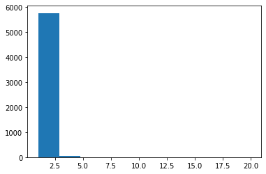


- 서울시 고객 전체에서 분포가 좌편향인 것을 확인할 수 있어서 적당한 기준을 통해 target을 설정한다.

  


```python
custTotal['VIP'] = 0
```


```python
# VIP 기준으로 고객을 구분짓는다(롯데백화점 400만원 + 롯데마트 600만원 + 롯데슈퍼 240만원 = 1240만원)
custTotal.loc[custTotal['구매금액_1년']>=12400000, 'VIP']=1
custTotal.loc[custTotal['구매금액_1년']<12400000, 'VIP']=0
```


```python
custTotal.head()
```

<table border="1" class="dataframe">
  <thead>
    <tr style="text-align: right;">
      <th></th>
      <th>구매금액</th>
      <th>구매금액_1년</th>
      <th>구매금액구간</th>
      <th>VIP</th>
    </tr>
    <tr>
      <th>고객번호</th>
      <th></th>
      <th></th>
      <th></th>
      <th></th>
    </tr>
  </thead>
  <tbody>
    <tr>
      <td>1</td>
      <td>85042550</td>
      <td>42521275</td>
      <td>1</td>
      <td>1</td>
    </tr>
    <tr>
      <td>3</td>
      <td>3165167</td>
      <td>1582583</td>
      <td>1</td>
      <td>0</td>
    </tr>
    <tr>
      <td>4</td>
      <td>16693810</td>
      <td>8346905</td>
      <td>1</td>
      <td>0</td>
    </tr>
    <tr>
      <td>7</td>
      <td>73726276</td>
      <td>36863138</td>
      <td>1</td>
      <td>1</td>
    </tr>
    <tr>
      <td>8</td>
      <td>62355952</td>
      <td>31177976</td>
      <td>1</td>
      <td>1</td>
    </tr>
  </tbody>
</table>


```python
plt.hist(custTotal['VIP'])
```


    (array([3191.,    0.,    0.,    0.,    0.,    0.,    0.,    0.,    0.,
            2650.]),
     array([0. , 0.1, 0.2, 0.3, 0.4, 0.5, 0.6, 0.7, 0.8, 0.9, 1. ]),
     <a list of 10 Patch objects>)


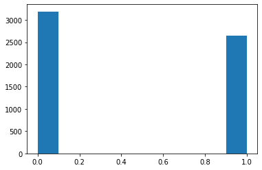


```python
custTotal['VIP'].value_counts()/custTotal['VIP'].value_counts().sum()
```


    0    0.546311
    1    0.453689
    Name: VIP, dtype: float64


  

## 3-1. client data


```python
s_df_client.head()
```

<table border="1" class="dataframe">
  <thead>
    <tr style="text-align: right;">
      <th></th>
      <th>고객번호</th>
      <th>성별</th>
      <th>연령대</th>
      <th>거주지역</th>
      <th>S_koo</th>
    </tr>
  </thead>
  <tbody>
    <tr>
      <td>0</td>
      <td>1</td>
      <td>M</td>
      <td>60세이상</td>
      <td>60.0</td>
      <td>강남구</td>
    </tr>
    <tr>
      <td>1</td>
      <td>3</td>
      <td>M</td>
      <td>60세이상</td>
      <td>33.0</td>
      <td>은평구</td>
    </tr>
    <tr>
      <td>2</td>
      <td>4</td>
      <td>F</td>
      <td>60세이상</td>
      <td>16.0</td>
      <td>노원구</td>
    </tr>
    <tr>
      <td>3</td>
      <td>7</td>
      <td>F</td>
      <td>60세이상</td>
      <td>36.0</td>
      <td>서대문구</td>
    </tr>
    <tr>
      <td>4</td>
      <td>8</td>
      <td>M</td>
      <td>60세이상</td>
      <td>10.0</td>
      <td>강북구</td>
    </tr>
  </tbody>
</table>


```python
custTotal.head()
```

<table border="1" class="dataframe">
  <thead>
    <tr style="text-align: right;">
      <th></th>
      <th>구매금액</th>
      <th>구매금액_1년</th>
      <th>구매금액구간</th>
      <th>VIP</th>
    </tr>
    <tr>
      <th>고객번호</th>
      <th></th>
      <th></th>
      <th></th>
      <th></th>
    </tr>
  </thead>
  <tbody>
    <tr>
      <td>1</td>
      <td>85042550</td>
      <td>42521275</td>
      <td>1</td>
      <td>1</td>
    </tr>
    <tr>
      <td>3</td>
      <td>3165167</td>
      <td>1582583</td>
      <td>1</td>
      <td>0</td>
    </tr>
    <tr>
      <td>4</td>
      <td>16693810</td>
      <td>8346905</td>
      <td>1</td>
      <td>0</td>
    </tr>
    <tr>
      <td>7</td>
      <td>73726276</td>
      <td>36863138</td>
      <td>1</td>
      <td>1</td>
    </tr>
    <tr>
      <td>8</td>
      <td>62355952</td>
      <td>31177976</td>
      <td>1</td>
      <td>1</td>
    </tr>
  </tbody>
</table>


```python
custTotal = custTotal.reset_index()
m_client = pd.merge(s_df_client, custTotal, how='left')
m_client.head()
```

<table border="1" class="dataframe">
  <thead>
    <tr style="text-align: right;">
      <th></th>
      <th>고객번호</th>
      <th>성별</th>
      <th>연령대</th>
      <th>거주지역</th>
      <th>S_koo</th>
      <th>구매금액</th>
      <th>구매금액_1년</th>
      <th>구매금액구간</th>
      <th>VIP</th>
    </tr>
  </thead>
  <tbody>
    <tr>
      <td>0</td>
      <td>1</td>
      <td>M</td>
      <td>60세이상</td>
      <td>60.0</td>
      <td>강남구</td>
      <td>85042550</td>
      <td>42521275</td>
      <td>1</td>
      <td>1</td>
    </tr>
    <tr>
      <td>1</td>
      <td>3</td>
      <td>M</td>
      <td>60세이상</td>
      <td>33.0</td>
      <td>은평구</td>
      <td>3165167</td>
      <td>1582583</td>
      <td>1</td>
      <td>0</td>
    </tr>
    <tr>
      <td>2</td>
      <td>4</td>
      <td>F</td>
      <td>60세이상</td>
      <td>16.0</td>
      <td>노원구</td>
      <td>16693810</td>
      <td>8346905</td>
      <td>1</td>
      <td>0</td>
    </tr>
    <tr>
      <td>3</td>
      <td>7</td>
      <td>F</td>
      <td>60세이상</td>
      <td>36.0</td>
      <td>서대문구</td>
      <td>73726276</td>
      <td>36863138</td>
      <td>1</td>
      <td>1</td>
    </tr>
    <tr>
      <td>4</td>
      <td>8</td>
      <td>M</td>
      <td>60세이상</td>
      <td>10.0</td>
      <td>강북구</td>
      <td>62355952</td>
      <td>31177976</td>
      <td>1</td>
      <td>1</td>
    </tr>
  </tbody>
</table>


### 성별


```python
m_client['성별'].value_counts()
```


    F    4854
    M     987
    Name: 성별, dtype: int64


```python
# F(여성) = 1, M(남성) = 0
for data in enumerate(m_client['성별'].unique()):
    m_client['성별'].replace(data[1], data[0], inplace=True)
```


```python
m_client['성별'].value_counts()
```


    1    4854
    0     987
    Name: 성별, dtype: int64


```python
cTab_sex = pd.crosstab(m_client['VIP'], m_client['성별'], margins=True)
cTab_sex
```

<table border="1" class="dataframe">
  <thead>
    <tr style="text-align: right;">
      <th>성별</th>
      <th>0</th>
      <th>1</th>
      <th>All</th>
    </tr>
    <tr>
      <th>VIP</th>
      <th></th>
      <th></th>
      <th></th>
    </tr>
  </thead>
  <tbody>
    <tr>
      <td>0</td>
      <td>550</td>
      <td>2641</td>
      <td>3191</td>
    </tr>
    <tr>
      <td>1</td>
      <td>437</td>
      <td>2213</td>
      <td>2650</td>
    </tr>
    <tr>
      <td>All</td>
      <td>987</td>
      <td>4854</td>
      <td>5841</td>
    </tr>
  </tbody>
</table>
- 위 표를 보아 여성 VIP 고객 비중이 남성 VIP 고객 비중의 약 5배 이상으로 볼 수 있다.

- 또한, 총 여성 고객 수의 대략 절반이 VIP 고객인 것을 확인할 수 있다.

- VIP 고객 중 약 80퍼센트가 여성임을 확인할 수 있다.

  

### 연령


```python
m_client['연령대'].value_counts()
```


    45세~49세    1215
    40세~44세     998
    50세~54세     965
    35세~39세     685
    55세~59세     637
    60세이상       618
    30세~34세     438
    25세~29세     205
    20세~24세      76
    19세이하         4
    Name: 연령대, dtype: int64


##### 연령대 변수 수치화
- 60세이상 : 6.0
- 55~59세 : 5.5
- 50~54세 : 5.0
- 45~49세 : 4.5
- 40~44세 : 4.0
- 35~39세 : 3.5
- 30~34세 : 3.0
- 25~29세 : 2.5
- 20~24세 : 2.0
- 19세이하 : 1.0


```python
# 연령대 수치화로 변경
m_client['연령대'] = m_client['연령대'].apply(lambda x : int(x[0:2]) * 0.1 if int(x[0:2]) > 20 else int(x[0:2])//10)
```


```python
m_client['연령대'].value_counts()
```


    4.5    1215
    4.0     998
    5.0     965
    3.5     685
    5.5     637
    6.0     618
    3.0     438
    2.5     205
    2.0      76
    1.0       4
    Name: 연령대, dtype: int64


```python
cTab_age = pd.crosstab(m_client['VIP'], m_client['연령대'], margins=True)
cTab_age
```

<table border="1" class="dataframe">
  <thead>
    <tr style="text-align: right;">
      <th>연령대</th>
      <th>1.0</th>
      <th>2.0</th>
      <th>2.5</th>
      <th>3.0</th>
      <th>3.5</th>
      <th>4.0</th>
      <th>4.5</th>
      <th>5.0</th>
      <th>5.5</th>
      <th>6.0</th>
      <th>All</th>
    </tr>
    <tr>
      <th>VIP</th>
      <th></th>
      <th></th>
      <th></th>
      <th></th>
      <th></th>
      <th></th>
      <th></th>
      <th></th>
      <th></th>
      <th></th>
      <th></th>
    </tr>
  </thead>
  <tbody>
    <tr>
      <td>0</td>
      <td>4</td>
      <td>65</td>
      <td>147</td>
      <td>270</td>
      <td>358</td>
      <td>553</td>
      <td>634</td>
      <td>523</td>
      <td>323</td>
      <td>314</td>
      <td>3191</td>
    </tr>
    <tr>
      <td>1</td>
      <td>0</td>
      <td>11</td>
      <td>58</td>
      <td>168</td>
      <td>327</td>
      <td>445</td>
      <td>581</td>
      <td>442</td>
      <td>314</td>
      <td>304</td>
      <td>2650</td>
    </tr>
    <tr>
      <td>All</td>
      <td>4</td>
      <td>76</td>
      <td>205</td>
      <td>438</td>
      <td>685</td>
      <td>998</td>
      <td>1215</td>
      <td>965</td>
      <td>637</td>
      <td>618</td>
      <td>5841</td>
    </tr>
  </tbody>
</table>
- 위 표에 근거하여 45~49세의 VIP 고객의 수가 연령대에서 가장 많은 것을 볼 수 있고
- 30세 이하의 VIP 고객 수가 일반 고객의 수보다 현저히 낮은 것을 확인할 수 있다.
- 전체적인 연령대를 보았을 때 40대 고객이 가장 많은 것을 확인할 수 있다.


```python
pd.crosstab(m_client['VIP'][m_client['성별']==1], m_client['연령대'], margins=True)
```

<table border="1" class="dataframe">
  <thead>
    <tr style="text-align: right;">
      <th>연령대</th>
      <th>1.0</th>
      <th>2.0</th>
      <th>2.5</th>
      <th>3.0</th>
      <th>3.5</th>
      <th>4.0</th>
      <th>4.5</th>
      <th>5.0</th>
      <th>5.5</th>
      <th>6.0</th>
      <th>All</th>
    </tr>
    <tr>
      <th>VIP</th>
      <th></th>
      <th></th>
      <th></th>
      <th></th>
      <th></th>
      <th></th>
      <th></th>
      <th></th>
      <th></th>
      <th></th>
      <th></th>
    </tr>
  </thead>
  <tbody>
    <tr>
      <td>0</td>
      <td>3</td>
      <td>58</td>
      <td>114</td>
      <td>209</td>
      <td>291</td>
      <td>432</td>
      <td>538</td>
      <td>458</td>
      <td>278</td>
      <td>260</td>
      <td>2641</td>
    </tr>
    <tr>
      <td>1</td>
      <td>0</td>
      <td>10</td>
      <td>51</td>
      <td>146</td>
      <td>271</td>
      <td>367</td>
      <td>483</td>
      <td>363</td>
      <td>261</td>
      <td>261</td>
      <td>2213</td>
    </tr>
    <tr>
      <td>All</td>
      <td>3</td>
      <td>68</td>
      <td>165</td>
      <td>355</td>
      <td>562</td>
      <td>799</td>
      <td>1021</td>
      <td>821</td>
      <td>539</td>
      <td>521</td>
      <td>4854</td>
    </tr>
  </tbody>
</table>
```python
pd.crosstab(m_client['VIP'][m_client['성별']==0], m_client['연령대'], margins=True)
```

<table border="1" class="dataframe">
  <thead>
    <tr style="text-align: right;">
      <th>연령대</th>
      <th>1.0</th>
      <th>2.0</th>
      <th>2.5</th>
      <th>3.0</th>
      <th>3.5</th>
      <th>4.0</th>
      <th>4.5</th>
      <th>5.0</th>
      <th>5.5</th>
      <th>6.0</th>
      <th>All</th>
    </tr>
    <tr>
      <th>VIP</th>
      <th></th>
      <th></th>
      <th></th>
      <th></th>
      <th></th>
      <th></th>
      <th></th>
      <th></th>
      <th></th>
      <th></th>
      <th></th>
    </tr>
  </thead>
  <tbody>
    <tr>
      <td>0</td>
      <td>1</td>
      <td>7</td>
      <td>33</td>
      <td>61</td>
      <td>67</td>
      <td>121</td>
      <td>96</td>
      <td>65</td>
      <td>45</td>
      <td>54</td>
      <td>550</td>
    </tr>
    <tr>
      <td>1</td>
      <td>0</td>
      <td>1</td>
      <td>7</td>
      <td>22</td>
      <td>56</td>
      <td>78</td>
      <td>98</td>
      <td>79</td>
      <td>53</td>
      <td>43</td>
      <td>437</td>
    </tr>
    <tr>
      <td>All</td>
      <td>1</td>
      <td>8</td>
      <td>40</td>
      <td>83</td>
      <td>123</td>
      <td>199</td>
      <td>194</td>
      <td>144</td>
      <td>98</td>
      <td>97</td>
      <td>987</td>
    </tr>
  </tbody>
</table>


```python
# 연령대와 성별의 관계가 VIP에 어떤 영향을 미치는지 시각화를 통해 살펴본다.
sns.factorplot('연령대', 'VIP', hue = '성별', data = m_client)
```


    <seaborn.axisgrid.FacetGrid at 0x1ea4f20a2c8>


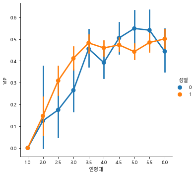


- 여성의 VIP비중이 20대에서 40대의 연령대에서 남성의 VIP 비중보다 큰 것을 볼 수 있고,

- 45세부터 60대 이전까지는 남성 VIP 고객의 비중이 더 큰 것을 확인할 수 있다.

  


```python
m_client['연령대'].sort_values()
```


    5714    1.0
    5589    1.0
    5733    1.0
    5276    1.0
    4998    2.0
           ... 
    233     6.0
    232     6.0
    231     6.0
    229     6.0
    0       6.0
    Name: 연령대, Length: 5841, dtype: float64


```python
plt.hist(m_client['연령대'].sort_values())
```


    (array([   4.,    0.,   76.,  205.,  438.,  685.,  998., 1215.,  965.,
            1255.]),
     array([1. , 1.5, 2. , 2.5, 3. , 3.5, 4. , 4.5, 5. , 5.5, 6. ]),
     <a list of 10 Patch objects>)


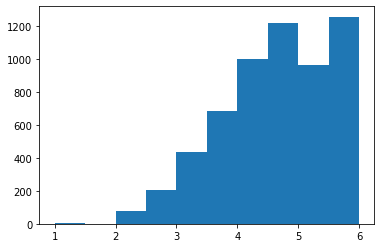


### 거주지역


```python
m_client['거주지역'].value_counts()
```


    55.0    1431
    16.0     819
    60.0     603
    24.0     339
    49.0     329
    47.0     278
    13.0     220
    10.0     185
    75.0     175
    27.0     146
    36.0     139
    39.0     119
    65.0     114
    72.0     109
    43.0     109
    33.0      96
    87.0      95
    69.0      94
    52.0      88
    20.0      76
    82.0      68
    30.0      66
    45.0      54
    79.0      48
    85.0      41
    Name: 거주지역, dtype: int64


```python
cTab_place = pd.crosstab(m_client['VIP'], m_client['거주지역'], margins=True)
cTab_place
```

<table border="1" class="dataframe">
  <thead>
    <tr style="text-align: right;">
      <th>거주지역</th>
      <th>10.0</th>
      <th>13.0</th>
      <th>16.0</th>
      <th>20.0</th>
      <th>24.0</th>
      <th>27.0</th>
      <th>30.0</th>
      <th>33.0</th>
      <th>36.0</th>
      <th>39.0</th>
      <th>...</th>
      <th>60.0</th>
      <th>65.0</th>
      <th>69.0</th>
      <th>72.0</th>
      <th>75.0</th>
      <th>79.0</th>
      <th>82.0</th>
      <th>85.0</th>
      <th>87.0</th>
      <th>All</th>
    </tr>
    <tr>
      <th>VIP</th>
      <th></th>
      <th></th>
      <th></th>
      <th></th>
      <th></th>
      <th></th>
      <th></th>
      <th></th>
      <th></th>
      <th></th>
      <th></th>
      <th></th>
      <th></th>
      <th></th>
      <th></th>
      <th></th>
      <th></th>
      <th></th>
      <th></th>
      <th></th>
      <th></th>
    </tr>
  </thead>
  <tbody>
    <tr>
      <td>0</td>
      <td>118</td>
      <td>114</td>
      <td>460</td>
      <td>37</td>
      <td>196</td>
      <td>71</td>
      <td>26</td>
      <td>70</td>
      <td>90</td>
      <td>69</td>
      <td>...</td>
      <td>239</td>
      <td>59</td>
      <td>46</td>
      <td>63</td>
      <td>144</td>
      <td>34</td>
      <td>50</td>
      <td>28</td>
      <td>57</td>
      <td>3191</td>
    </tr>
    <tr>
      <td>1</td>
      <td>67</td>
      <td>106</td>
      <td>359</td>
      <td>39</td>
      <td>143</td>
      <td>75</td>
      <td>40</td>
      <td>26</td>
      <td>49</td>
      <td>50</td>
      <td>...</td>
      <td>364</td>
      <td>55</td>
      <td>48</td>
      <td>46</td>
      <td>31</td>
      <td>14</td>
      <td>18</td>
      <td>13</td>
      <td>38</td>
      <td>2650</td>
    </tr>
    <tr>
      <td>All</td>
      <td>185</td>
      <td>220</td>
      <td>819</td>
      <td>76</td>
      <td>339</td>
      <td>146</td>
      <td>66</td>
      <td>96</td>
      <td>139</td>
      <td>119</td>
      <td>...</td>
      <td>603</td>
      <td>114</td>
      <td>94</td>
      <td>109</td>
      <td>175</td>
      <td>48</td>
      <td>68</td>
      <td>41</td>
      <td>95</td>
      <td>5841</td>
    </tr>
  </tbody>
</table>
<p>3 rows × 26 columns</p>
```python
plt.hist(m_client['거주지역'])
```


    (array([1224.,  415.,  308.,  258.,  441., 1848.,  603.,  208.,  332.,
             204.]),
     array([10. , 17.7, 25.4, 33.1, 40.8, 48.5, 56.2, 63.9, 71.6, 79.3, 87. ]),
     <a list of 10 Patch objects>)


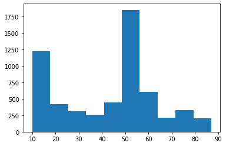


```python
m_client
```

<table border="1" class="dataframe">
  <thead>
    <tr style="text-align: right;">
      <th></th>
      <th>고객번호</th>
      <th>성별</th>
      <th>연령대</th>
      <th>거주지역</th>
      <th>S_koo</th>
      <th>구매금액</th>
      <th>구매금액_1년</th>
      <th>구매금액구간</th>
      <th>VIP</th>
    </tr>
  </thead>
  <tbody>
    <tr>
      <td>0</td>
      <td>1</td>
      <td>0</td>
      <td>6.0</td>
      <td>60.0</td>
      <td>강남구</td>
      <td>85042550</td>
      <td>42521275</td>
      <td>1</td>
      <td>1</td>
    </tr>
    <tr>
      <td>1</td>
      <td>3</td>
      <td>0</td>
      <td>6.0</td>
      <td>33.0</td>
      <td>은평구</td>
      <td>3165167</td>
      <td>1582583</td>
      <td>1</td>
      <td>0</td>
    </tr>
    <tr>
      <td>2</td>
      <td>4</td>
      <td>1</td>
      <td>6.0</td>
      <td>16.0</td>
      <td>노원구</td>
      <td>16693810</td>
      <td>8346905</td>
      <td>1</td>
      <td>0</td>
    </tr>
    <tr>
      <td>3</td>
      <td>7</td>
      <td>1</td>
      <td>6.0</td>
      <td>36.0</td>
      <td>서대문구</td>
      <td>73726276</td>
      <td>36863138</td>
      <td>1</td>
      <td>1</td>
    </tr>
    <tr>
      <td>4</td>
      <td>8</td>
      <td>0</td>
      <td>6.0</td>
      <td>10.0</td>
      <td>강북구</td>
      <td>62355952</td>
      <td>31177976</td>
      <td>1</td>
      <td>1</td>
    </tr>
    <tr>
      <td>...</td>
      <td>...</td>
      <td>...</td>
      <td>...</td>
      <td>...</td>
      <td>...</td>
      <td>...</td>
      <td>...</td>
      <td>...</td>
      <td>...</td>
    </tr>
    <tr>
      <td>5836</td>
      <td>19371</td>
      <td>1</td>
      <td>5.0</td>
      <td>52.0</td>
      <td>강동구</td>
      <td>6013639</td>
      <td>3006819</td>
      <td>1</td>
      <td>0</td>
    </tr>
    <tr>
      <td>5837</td>
      <td>19375</td>
      <td>1</td>
      <td>2.5</td>
      <td>49.0</td>
      <td>광진구</td>
      <td>21486594</td>
      <td>10743297</td>
      <td>1</td>
      <td>0</td>
    </tr>
    <tr>
      <td>5838</td>
      <td>19376</td>
      <td>0</td>
      <td>2.0</td>
      <td>24.0</td>
      <td>동대문구</td>
      <td>7068554</td>
      <td>3534277</td>
      <td>1</td>
      <td>0</td>
    </tr>
    <tr>
      <td>5839</td>
      <td>19379</td>
      <td>1</td>
      <td>2.0</td>
      <td>69.0</td>
      <td>동작구</td>
      <td>5779280</td>
      <td>2889640</td>
      <td>1</td>
      <td>0</td>
    </tr>
    <tr>
      <td>5840</td>
      <td>19380</td>
      <td>1</td>
      <td>2.0</td>
      <td>39.0</td>
      <td>마포구</td>
      <td>3912977</td>
      <td>1956488</td>
      <td>1</td>
      <td>0</td>
    </tr>
  </tbody>
</table>
<p>5841 rows × 9 columns</p>
```python
vip_place = m_client['거주지역'][m_client['VIP'] == 1]
vip_place
```


    0       60.0
    3       36.0
    4       10.0
    7       43.0
    8       24.0
            ... 
    5815    52.0
    5817    43.0
    5819    39.0
    5823    39.0
    5830    16.0
    Name: 거주지역, Length: 2650, dtype: float64


```python
normal_place = m_client['거주지역'][m_client['VIP'] == 0]
normal_place
```


    1       33.0
    2       16.0
    5       24.0
    6       43.0
    10      33.0
            ... 
    5836    52.0
    5837    49.0
    5838    24.0
    5839    69.0
    5840    39.0
    Name: 거주지역, Length: 3191, dtype: float64


```python
plt.figure(figsize =(10, 10))
vip_place.plot(kind='kde')
normal_place.plot(kind='kde')
plt.legend(['vip_place', 'normal_place'])
```


    <matplotlib.legend.Legend at 0x1ea4f481908>


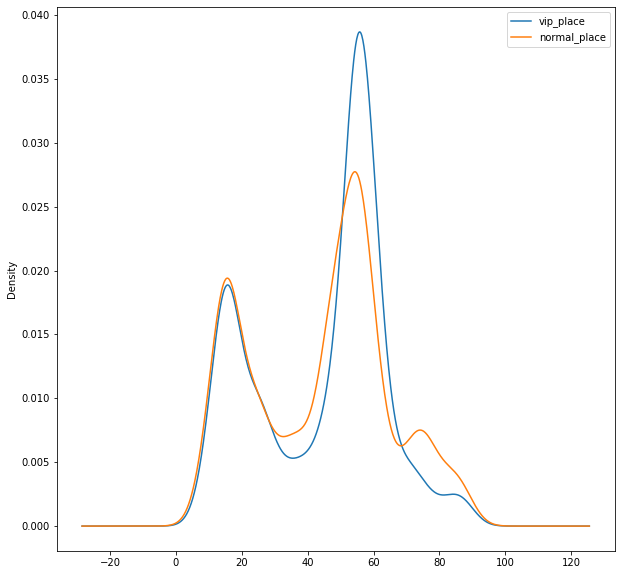


```python
vip_place.value_counts()
```


    55.0    785
    60.0    364
    16.0    359
    24.0    143
    49.0    112
    13.0    106
    27.0     75
    10.0     67
    47.0     65
    65.0     55
    39.0     50
    36.0     49
    69.0     48
    72.0     46
    43.0     45
    30.0     40
    20.0     39
    87.0     38
    52.0     34
    75.0     31
    45.0     28
    33.0     26
    82.0     18
    79.0     14
    85.0     13
    Name: 거주지역, dtype: int64


```python
# vip수가 가장 많은 지역 확인
print(m_client['S_koo'][m_client['거주지역']==55].unique())
print(m_client['S_koo'][m_client['거주지역']==60].unique())
print(m_client['S_koo'][m_client['거주지역']==16].unique())
```

    ['송파구']
    ['강남구']
    ['노원구']


```python
# 거주지역 번호가 70이상인 곳에서 VIP 이용객의 수가 적기 때문에 어떤 지역인지 확인
m_client['S_koo'][m_client['거주지역']>=70].unique()
```


    array(['관악구', '영등포구', '강서구', '구로구', '양천구', '금천구'], dtype=object)


- '송파구', '강남구', '노원구' 순서로 해당 지역 주민들의 vip수가 상대적으로 많은 것을 볼 수 있다.
- '관악구', '영등포구', '강서구', '구로구', '양천구', '금천구' 지역 주민들의 vip 수가 상대적으로 적은 것을 확인할 수 있다.


```python
m_client.corr()["VIP"]
```


    고객번호      -0.224066
    성별         0.009903
    연령대        0.081950
    거주지역       0.013590
    구매금액       0.451925
    구매금액_1년    0.451925
    구매금액구간     0.183002
    VIP        1.000000
    Name: VIP, dtype: float64


  

## 3-2. purchase data


```python
s_df_purchase.head()
```

<table border="1" class="dataframe">
  <thead>
    <tr style="text-align: right;">
      <th></th>
      <th>고객번호</th>
      <th>성별</th>
      <th>연령대</th>
      <th>거주지역</th>
      <th>S_koo</th>
      <th>제휴사</th>
      <th>영수증번호</th>
      <th>대분류코드</th>
      <th>중분류코드</th>
      <th>소분류코드</th>
      <th>점포코드</th>
      <th>구매일자</th>
      <th>구매시간</th>
      <th>구매금액</th>
    </tr>
  </thead>
  <tbody>
    <tr>
      <td>0</td>
      <td>1</td>
      <td>M</td>
      <td>60세이상</td>
      <td>60.0</td>
      <td>강남구</td>
      <td>A</td>
      <td>1239451</td>
      <td>2</td>
      <td>201</td>
      <td>A020105</td>
      <td>12</td>
      <td>20140118</td>
      <td>15</td>
      <td>10000</td>
    </tr>
    <tr>
      <td>1</td>
      <td>1</td>
      <td>M</td>
      <td>60세이상</td>
      <td>60.0</td>
      <td>강남구</td>
      <td>A</td>
      <td>1319908</td>
      <td>4</td>
      <td>402</td>
      <td>A040214</td>
      <td>20</td>
      <td>20140203</td>
      <td>15</td>
      <td>129000</td>
    </tr>
    <tr>
      <td>2</td>
      <td>1</td>
      <td>M</td>
      <td>60세이상</td>
      <td>60.0</td>
      <td>강남구</td>
      <td>A</td>
      <td>1807440</td>
      <td>1</td>
      <td>103</td>
      <td>A010302</td>
      <td>12</td>
      <td>20140425</td>
      <td>12</td>
      <td>7000</td>
    </tr>
    <tr>
      <td>3</td>
      <td>1</td>
      <td>M</td>
      <td>60세이상</td>
      <td>60.0</td>
      <td>강남구</td>
      <td>A</td>
      <td>1807440</td>
      <td>1</td>
      <td>104</td>
      <td>A010404</td>
      <td>12</td>
      <td>20140425</td>
      <td>12</td>
      <td>2650</td>
    </tr>
    <tr>
      <td>4</td>
      <td>1</td>
      <td>M</td>
      <td>60세이상</td>
      <td>60.0</td>
      <td>강남구</td>
      <td>A</td>
      <td>1807440</td>
      <td>1</td>
      <td>105</td>
      <td>A010501</td>
      <td>12</td>
      <td>20140425</td>
      <td>12</td>
      <td>9800</td>
    </tr>
  </tbody>
</table>


```python
custTotal.head()
```

<table border="1" class="dataframe">
  <thead>
    <tr style="text-align: right;">
      <th></th>
      <th>고객번호</th>
      <th>구매금액</th>
      <th>구매금액_1년</th>
      <th>구매금액구간</th>
      <th>VIP</th>
    </tr>
  </thead>
  <tbody>
    <tr>
      <td>0</td>
      <td>1</td>
      <td>85042550</td>
      <td>42521275</td>
      <td>1</td>
      <td>1</td>
    </tr>
    <tr>
      <td>1</td>
      <td>3</td>
      <td>3165167</td>
      <td>1582583</td>
      <td>1</td>
      <td>0</td>
    </tr>
    <tr>
      <td>2</td>
      <td>4</td>
      <td>16693810</td>
      <td>8346905</td>
      <td>1</td>
      <td>0</td>
    </tr>
    <tr>
      <td>3</td>
      <td>7</td>
      <td>73726276</td>
      <td>36863138</td>
      <td>1</td>
      <td>1</td>
    </tr>
    <tr>
      <td>4</td>
      <td>8</td>
      <td>62355952</td>
      <td>31177976</td>
      <td>1</td>
      <td>1</td>
    </tr>
  </tbody>
</table>


```python
custVIP = custTotal[['고객번호', '구매금액구간', 'VIP']]
m_purchase = pd.merge(s_df_purchase, custVIP, how='left')
m_purchase.head()
```

<table border="1" class="dataframe">
  <thead>
    <tr style="text-align: right;">
      <th></th>
      <th>고객번호</th>
      <th>성별</th>
      <th>연령대</th>
      <th>거주지역</th>
      <th>S_koo</th>
      <th>제휴사</th>
      <th>영수증번호</th>
      <th>대분류코드</th>
      <th>중분류코드</th>
      <th>소분류코드</th>
      <th>점포코드</th>
      <th>구매일자</th>
      <th>구매시간</th>
      <th>구매금액</th>
      <th>구매금액구간</th>
      <th>VIP</th>
    </tr>
  </thead>
  <tbody>
    <tr>
      <td>0</td>
      <td>1</td>
      <td>M</td>
      <td>60세이상</td>
      <td>60.0</td>
      <td>강남구</td>
      <td>A</td>
      <td>1239451</td>
      <td>2</td>
      <td>201</td>
      <td>A020105</td>
      <td>12</td>
      <td>20140118</td>
      <td>15</td>
      <td>10000</td>
      <td>1</td>
      <td>1</td>
    </tr>
    <tr>
      <td>1</td>
      <td>1</td>
      <td>M</td>
      <td>60세이상</td>
      <td>60.0</td>
      <td>강남구</td>
      <td>A</td>
      <td>1319908</td>
      <td>4</td>
      <td>402</td>
      <td>A040214</td>
      <td>20</td>
      <td>20140203</td>
      <td>15</td>
      <td>129000</td>
      <td>1</td>
      <td>1</td>
    </tr>
    <tr>
      <td>2</td>
      <td>1</td>
      <td>M</td>
      <td>60세이상</td>
      <td>60.0</td>
      <td>강남구</td>
      <td>A</td>
      <td>1807440</td>
      <td>1</td>
      <td>103</td>
      <td>A010302</td>
      <td>12</td>
      <td>20140425</td>
      <td>12</td>
      <td>7000</td>
      <td>1</td>
      <td>1</td>
    </tr>
    <tr>
      <td>3</td>
      <td>1</td>
      <td>M</td>
      <td>60세이상</td>
      <td>60.0</td>
      <td>강남구</td>
      <td>A</td>
      <td>1807440</td>
      <td>1</td>
      <td>104</td>
      <td>A010404</td>
      <td>12</td>
      <td>20140425</td>
      <td>12</td>
      <td>2650</td>
      <td>1</td>
      <td>1</td>
    </tr>
    <tr>
      <td>4</td>
      <td>1</td>
      <td>M</td>
      <td>60세이상</td>
      <td>60.0</td>
      <td>강남구</td>
      <td>A</td>
      <td>1807440</td>
      <td>1</td>
      <td>105</td>
      <td>A010501</td>
      <td>12</td>
      <td>20140425</td>
      <td>12</td>
      <td>9800</td>
      <td>1</td>
      <td>1</td>
    </tr>
  </tbody>
</table>


### 제휴사


```python
m_purchase['구매금액'].groupby(m_purchase['제휴사']).describe()
```

<table border="1" class="dataframe">
  <thead>
    <tr style="text-align: right;">
      <th></th>
      <th>count</th>
      <th>mean</th>
      <th>std</th>
      <th>min</th>
      <th>25%</th>
      <th>50%</th>
      <th>75%</th>
      <th>max</th>
    </tr>
    <tr>
      <th>제휴사</th>
      <th></th>
      <th></th>
      <th></th>
      <th></th>
      <th></th>
      <th></th>
      <th></th>
      <th></th>
    </tr>
  </thead>
  <tbody>
    <tr>
      <td>A</td>
      <td>2275481.0</td>
      <td>84155.929529</td>
      <td>429816.276303</td>
      <td>10.0</td>
      <td>6500.0</td>
      <td>14500.0</td>
      <td>49000.0</td>
      <td>93654000.0</td>
    </tr>
    <tr>
      <td>B</td>
      <td>3345302.0</td>
      <td>9053.366342</td>
      <td>129504.170345</td>
      <td>10.0</td>
      <td>2380.0</td>
      <td>4280.0</td>
      <td>7980.0</td>
      <td>48112000.0</td>
    </tr>
    <tr>
      <td>C</td>
      <td>2513395.0</td>
      <td>5210.101344</td>
      <td>61413.931026</td>
      <td>10.0</td>
      <td>1490.0</td>
      <td>2960.0</td>
      <td>5000.0</td>
      <td>23976000.0</td>
    </tr>
    <tr>
      <td>D</td>
      <td>47814.0</td>
      <td>8428.949555</td>
      <td>12872.029077</td>
      <td>100.0</td>
      <td>1600.0</td>
      <td>3600.0</td>
      <td>9900.0</td>
      <td>291000.0</td>
    </tr>
  </tbody>
</table>


```python
m_purchase[m_purchase['구매금액']==93654000.0]
```

<table border="1" class="dataframe">
  <thead>
    <tr style="text-align: right;">
      <th></th>
      <th>고객번호</th>
      <th>성별</th>
      <th>연령대</th>
      <th>거주지역</th>
      <th>S_koo</th>
      <th>제휴사</th>
      <th>영수증번호</th>
      <th>대분류코드</th>
      <th>중분류코드</th>
      <th>소분류코드</th>
      <th>점포코드</th>
      <th>구매일자</th>
      <th>구매시간</th>
      <th>구매금액</th>
      <th>구매금액구간</th>
      <th>VIP</th>
    </tr>
  </thead>
  <tbody>
    <tr>
      <td>4026114</td>
      <td>7801</td>
      <td>M</td>
      <td>40세~44세</td>
      <td>69.0</td>
      <td>동작구</td>
      <td>A</td>
      <td>5526155</td>
      <td>1</td>
      <td>109</td>
      <td>A010901</td>
      <td>1</td>
      <td>20151120</td>
      <td>13</td>
      <td>93654000</td>
      <td>7</td>
      <td>1</td>
    </tr>
  </tbody>
</table>


```python
m_purchase[m_purchase['구매금액']==87769260.0]
```

<table border="1" class="dataframe">
  <thead>
    <tr style="text-align: right;">
      <th></th>
      <th>고객번호</th>
      <th>성별</th>
      <th>연령대</th>
      <th>거주지역</th>
      <th>S_koo</th>
      <th>제휴사</th>
      <th>영수증번호</th>
      <th>대분류코드</th>
      <th>중분류코드</th>
      <th>소분류코드</th>
      <th>점포코드</th>
      <th>구매일자</th>
      <th>구매시간</th>
      <th>구매금액</th>
      <th>구매금액구간</th>
      <th>VIP</th>
    </tr>
  </thead>
  <tbody>
    <tr>
      <td>5931538</td>
      <td>13376</td>
      <td>F</td>
      <td>25세~29세</td>
      <td>16.0</td>
      <td>노원구</td>
      <td>A</td>
      <td>4593637</td>
      <td>8</td>
      <td>801</td>
      <td>A080110</td>
      <td>1</td>
      <td>20150627</td>
      <td>16</td>
      <td>87769260</td>
      <td>10</td>
      <td>1</td>
    </tr>
  </tbody>
</table>


```python
m_purchase[m_purchase['고객번호']==7801][m_purchase['구매금액']==120]
```

<table border="1" class="dataframe">
  <thead>
    <tr style="text-align: right;">
      <th></th>
      <th>고객번호</th>
      <th>성별</th>
      <th>연령대</th>
      <th>거주지역</th>
      <th>S_koo</th>
      <th>제휴사</th>
      <th>영수증번호</th>
      <th>대분류코드</th>
      <th>중분류코드</th>
      <th>소분류코드</th>
      <th>점포코드</th>
      <th>구매일자</th>
      <th>구매시간</th>
      <th>구매금액</th>
      <th>구매금액구간</th>
      <th>VIP</th>
    </tr>
  </thead>
  <tbody>
    <tr>
      <td>4026220</td>
      <td>7801</td>
      <td>M</td>
      <td>40세~44세</td>
      <td>69.0</td>
      <td>동작구</td>
      <td>A</td>
      <td>2012213</td>
      <td>1</td>
      <td>109</td>
      <td>A010904</td>
      <td>1</td>
      <td>20140525</td>
      <td>20</td>
      <td>120</td>
      <td>7</td>
      <td>1</td>
    </tr>
  </tbody>
</table>


```python
m_purchase['구매금액'][m_purchase['고객번호']==7801].describe()
```


    count    6.320000e+02
    mean     1.160122e+06
    std      4.546237e+06
    min      1.200000e+02
    25%      3.000000e+04
    50%      1.995000e+05
    75%      1.000000e+06
    max      9.365400e+07
    Name: 구매금액, dtype: float64


```python
df_product[df_product['소분류코드']=='A010901']
```

<table border="1" class="dataframe">
  <thead>
    <tr style="text-align: right;">
      <th></th>
      <th>제휴사</th>
      <th>대분류코드</th>
      <th>중분류코드</th>
      <th>소분류코드</th>
      <th>중분류명</th>
      <th>소분류명</th>
    </tr>
  </thead>
  <tbody>
    <tr>
      <td>120</td>
      <td>A</td>
      <td>1</td>
      <td>109</td>
      <td>A010901</td>
      <td>주류</td>
      <td>주류</td>
    </tr>
  </tbody>
</table>


```python
df_product[df_product['소분류코드']=='A010904']
```

<table border="1" class="dataframe">
  <thead>
    <tr style="text-align: right;">
      <th></th>
      <th>제휴사</th>
      <th>대분류코드</th>
      <th>중분류코드</th>
      <th>소분류코드</th>
      <th>중분류명</th>
      <th>소분류명</th>
    </tr>
  </thead>
  <tbody>
    <tr>
      <td>123</td>
      <td>A</td>
      <td>1</td>
      <td>109</td>
      <td>A010904</td>
      <td>주류</td>
      <td>공병</td>
    </tr>
  </tbody>
</table>


```python
pd.crosstab(m_purchase['제휴사'], m_purchase['VIP'], margins=True)
```

<table border="1" class="dataframe">
  <thead>
    <tr style="text-align: right;">
      <th>VIP</th>
      <th>0</th>
      <th>1</th>
      <th>All</th>
    </tr>
    <tr>
      <th>제휴사</th>
      <th></th>
      <th></th>
      <th></th>
    </tr>
  </thead>
  <tbody>
    <tr>
      <td>A</td>
      <td>614956</td>
      <td>1660525</td>
      <td>2275481</td>
    </tr>
    <tr>
      <td>B</td>
      <td>2213904</td>
      <td>1131398</td>
      <td>3345302</td>
    </tr>
    <tr>
      <td>C</td>
      <td>1932208</td>
      <td>581187</td>
      <td>2513395</td>
    </tr>
    <tr>
      <td>D</td>
      <td>41174</td>
      <td>6640</td>
      <td>47814</td>
    </tr>
    <tr>
      <td>All</td>
      <td>4802242</td>
      <td>3379750</td>
      <td>8181992</td>
    </tr>
  </tbody>
</table>


```python
# 제휴사 A,B,C,D를 번호로 바꾸어 준다.(A->0 B->2 C->1 D->3)
for data in enumerate(m_purchase['제휴사'].unique()):
    m_purchase['제휴사'].replace(data[1], data[0], inplace=True)
```


```python
m_purchase['제휴사'].value_counts()
```


    2    3345302
    1    2513395
    0    2275481
    3      47814
    Name: 제휴사, dtype: int64


```python
vip_compnay = m_purchase['제휴사'][m_purchase['VIP'] == 1]
normal_company = m_purchase['제휴사'][m_purchase['VIP'] == 0]
```


```python
plt.figure(figsize =(10, 10))
vip_compnay.plot(kind='kde')
normal_company.plot(kind='kde')
plt.legend(['vip_compnay', 'normal_company'])
```


    <matplotlib.legend.Legend at 0x1ea50922f48>


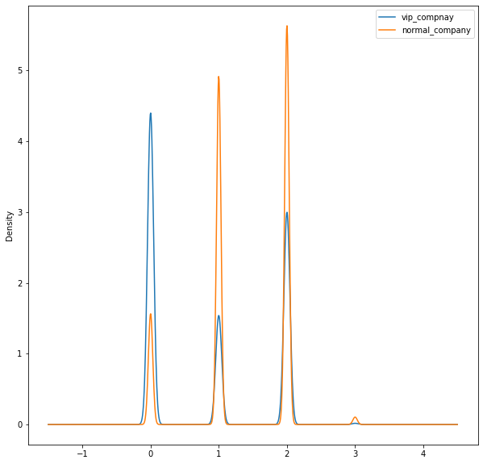


- vip 고객 비중이 압도적으로 A 제휴사가 높은 것을 확인할 수 있다.


### 영수증번호


```python
print(m_purchase['구매금액'].groupby(m_purchase['영수증번호']).mean().max())
print(m_purchase['구매금액'].groupby(m_purchase['영수증번호']).mean().min())
```

    93654000.0
    10.0


```python
m_purchase.groupby(m_purchase['영수증번호']).sum().reset_index()
```

<table border="1" class="dataframe">
  <thead>
    <tr style="text-align: right;">
      <th></th>
      <th>영수증번호</th>
      <th>고객번호</th>
      <th>거주지역</th>
      <th>제휴사</th>
      <th>대분류코드</th>
      <th>중분류코드</th>
      <th>점포코드</th>
      <th>구매일자</th>
      <th>구매시간</th>
      <th>구매금액</th>
      <th>구매금액구간</th>
      <th>VIP</th>
    </tr>
  </thead>
  <tbody>
    <tr>
      <td>0</td>
      <td>1</td>
      <td>2263</td>
      <td>24.0</td>
      <td>1</td>
      <td>6</td>
      <td>605</td>
      <td>1</td>
      <td>20140101</td>
      <td>9</td>
      <td>5950</td>
      <td>1</td>
      <td>0</td>
    </tr>
    <tr>
      <td>1</td>
      <td>2</td>
      <td>2263</td>
      <td>24.0</td>
      <td>1</td>
      <td>15</td>
      <td>1502</td>
      <td>1</td>
      <td>20140101</td>
      <td>12</td>
      <td>1490</td>
      <td>1</td>
      <td>0</td>
    </tr>
    <tr>
      <td>2</td>
      <td>3</td>
      <td>18336</td>
      <td>24.0</td>
      <td>1</td>
      <td>13</td>
      <td>1307</td>
      <td>1</td>
      <td>20140101</td>
      <td>16</td>
      <td>3980</td>
      <td>1</td>
      <td>0</td>
    </tr>
    <tr>
      <td>3</td>
      <td>4</td>
      <td>36100</td>
      <td>48.0</td>
      <td>2</td>
      <td>12</td>
      <td>1203</td>
      <td>2</td>
      <td>40280202</td>
      <td>32</td>
      <td>10090</td>
      <td>2</td>
      <td>0</td>
    </tr>
    <tr>
      <td>4</td>
      <td>5</td>
      <td>18104</td>
      <td>192.0</td>
      <td>8</td>
      <td>58</td>
      <td>5826</td>
      <td>8</td>
      <td>161120808</td>
      <td>144</td>
      <td>65620</td>
      <td>8</td>
      <td>0</td>
    </tr>
    <tr>
      <td>...</td>
      <td>...</td>
      <td>...</td>
      <td>...</td>
      <td>...</td>
      <td>...</td>
      <td>...</td>
      <td>...</td>
      <td>...</td>
      <td>...</td>
      <td>...</td>
      <td>...</td>
      <td>...</td>
    </tr>
    <tr>
      <td>3451378</td>
      <td>11096588</td>
      <td>31276</td>
      <td>64.0</td>
      <td>8</td>
      <td>87</td>
      <td>8724</td>
      <td>540</td>
      <td>80604052</td>
      <td>36</td>
      <td>57500</td>
      <td>4</td>
      <td>0</td>
    </tr>
    <tr>
      <td>3451379</td>
      <td>11096589</td>
      <td>37700</td>
      <td>300.0</td>
      <td>10</td>
      <td>218</td>
      <td>21813</td>
      <td>675</td>
      <td>100755065</td>
      <td>75</td>
      <td>118600</td>
      <td>5</td>
      <td>0</td>
    </tr>
    <tr>
      <td>3451380</td>
      <td>11096590</td>
      <td>30160</td>
      <td>240.0</td>
      <td>8</td>
      <td>187</td>
      <td>18712</td>
      <td>540</td>
      <td>80604056</td>
      <td>68</td>
      <td>75600</td>
      <td>4</td>
      <td>0</td>
    </tr>
    <tr>
      <td>3451381</td>
      <td>11096593</td>
      <td>81222</td>
      <td>330.0</td>
      <td>12</td>
      <td>266</td>
      <td>26632</td>
      <td>810</td>
      <td>120906156</td>
      <td>138</td>
      <td>54000</td>
      <td>6</td>
      <td>0</td>
    </tr>
    <tr>
      <td>3451382</td>
      <td>11096601</td>
      <td>104352</td>
      <td>960.0</td>
      <td>32</td>
      <td>769</td>
      <td>76975</td>
      <td>2160</td>
      <td>322419568</td>
      <td>224</td>
      <td>164030</td>
      <td>16</td>
      <td>16</td>
    </tr>
  </tbody>
</table>
<p>3451383 rows × 12 columns</p>
```python
# 결제당 구매총액을 구한다.
totalBill = m_purchase.groupby(m_purchase['영수증번호']).sum()
totalBill = totalBill.reset_index()
totalBill['영수증총액'] = totalBill['구매금액']
totalBill = totalBill[['영수증번호', '영수증총액']]
totalBill.head()
```

<table border="1" class="dataframe">
  <thead>
    <tr style="text-align: right;">
      <th></th>
      <th>영수증번호</th>
      <th>영수증총액</th>
    </tr>
  </thead>
  <tbody>
    <tr>
      <td>0</td>
      <td>1</td>
      <td>5950</td>
    </tr>
    <tr>
      <td>1</td>
      <td>2</td>
      <td>1490</td>
    </tr>
    <tr>
      <td>2</td>
      <td>3</td>
      <td>3980</td>
    </tr>
    <tr>
      <td>3</td>
      <td>4</td>
      <td>10090</td>
    </tr>
    <tr>
      <td>4</td>
      <td>5</td>
      <td>65620</td>
    </tr>
  </tbody>
</table>


```python
bill_m_purchase = pd.merge(m_purchase, totalBill, how='left')
bill_m_purchase.head()
```

<table border="1" class="dataframe">
  <thead>
    <tr style="text-align: right;">
      <th></th>
      <th>고객번호</th>
      <th>성별</th>
      <th>연령대</th>
      <th>거주지역</th>
      <th>S_koo</th>
      <th>제휴사</th>
      <th>영수증번호</th>
      <th>대분류코드</th>
      <th>중분류코드</th>
      <th>소분류코드</th>
      <th>점포코드</th>
      <th>구매일자</th>
      <th>구매시간</th>
      <th>구매금액</th>
      <th>구매금액구간</th>
      <th>VIP</th>
      <th>영수증총액</th>
    </tr>
  </thead>
  <tbody>
    <tr>
      <td>0</td>
      <td>1</td>
      <td>M</td>
      <td>60세이상</td>
      <td>60.0</td>
      <td>강남구</td>
      <td>0</td>
      <td>1239451</td>
      <td>2</td>
      <td>201</td>
      <td>A020105</td>
      <td>12</td>
      <td>20140118</td>
      <td>15</td>
      <td>10000</td>
      <td>1</td>
      <td>1</td>
      <td>10000</td>
    </tr>
    <tr>
      <td>1</td>
      <td>1</td>
      <td>M</td>
      <td>60세이상</td>
      <td>60.0</td>
      <td>강남구</td>
      <td>0</td>
      <td>1319908</td>
      <td>4</td>
      <td>402</td>
      <td>A040214</td>
      <td>20</td>
      <td>20140203</td>
      <td>15</td>
      <td>129000</td>
      <td>1</td>
      <td>1</td>
      <td>129000</td>
    </tr>
    <tr>
      <td>2</td>
      <td>1</td>
      <td>M</td>
      <td>60세이상</td>
      <td>60.0</td>
      <td>강남구</td>
      <td>0</td>
      <td>1807440</td>
      <td>1</td>
      <td>103</td>
      <td>A010302</td>
      <td>12</td>
      <td>20140425</td>
      <td>12</td>
      <td>7000</td>
      <td>1</td>
      <td>1</td>
      <td>58450</td>
    </tr>
    <tr>
      <td>3</td>
      <td>1</td>
      <td>M</td>
      <td>60세이상</td>
      <td>60.0</td>
      <td>강남구</td>
      <td>0</td>
      <td>1807440</td>
      <td>1</td>
      <td>104</td>
      <td>A010404</td>
      <td>12</td>
      <td>20140425</td>
      <td>12</td>
      <td>2650</td>
      <td>1</td>
      <td>1</td>
      <td>58450</td>
    </tr>
    <tr>
      <td>4</td>
      <td>1</td>
      <td>M</td>
      <td>60세이상</td>
      <td>60.0</td>
      <td>강남구</td>
      <td>0</td>
      <td>1807440</td>
      <td>1</td>
      <td>105</td>
      <td>A010501</td>
      <td>12</td>
      <td>20140425</td>
      <td>12</td>
      <td>9800</td>
      <td>1</td>
      <td>1</td>
      <td>58450</td>
    </tr>
  </tbody>
</table>


```python
bill_m_purchase['영수증총액'].describe()
```


    count    8.181992e+06
    mean     5.760913e+04
    std      2.569510e+05
    min      1.000000e+01
    25%      1.185000e+04
    50%      2.696000e+04
    75%      5.800000e+04
    max      9.365400e+07
    Name: 영수증총액, dtype: float64


```python
bill_m_purchase['영수증총액'].groupby(bill_m_purchase['VIP']).describe()
```

<table border="1" class="dataframe">
  <thead>
    <tr style="text-align: right;">
      <th></th>
      <th>count</th>
      <th>mean</th>
      <th>std</th>
      <th>min</th>
      <th>25%</th>
      <th>50%</th>
      <th>75%</th>
      <th>max</th>
    </tr>
    <tr>
      <th>VIP</th>
      <th></th>
      <th></th>
      <th></th>
      <th></th>
      <th></th>
      <th></th>
      <th></th>
      <th></th>
    </tr>
  </thead>
  <tbody>
    <tr>
      <td>0</td>
      <td>4802242.0</td>
      <td>32554.234408</td>
      <td>45185.366734</td>
      <td>10.0</td>
      <td>9910.0</td>
      <td>20640.0</td>
      <td>40860.00</td>
      <td>7422500.0</td>
    </tr>
    <tr>
      <td>1</td>
      <td>3379750.0</td>
      <td>93209.296590</td>
      <td>393415.649288</td>
      <td>20.0</td>
      <td>17950.0</td>
      <td>41580.0</td>
      <td>87878.75</td>
      <td>93654000.0</td>
    </tr>
  </tbody>
</table>
- vip 고객의 구매건수보다 vip 아닌 고객의 구매건수가 많지만, vip고객은  평균값이 더 크고 편차가 더 크게 나타난 것을 알 수 있다.

  

### 분류코드


```python
m_purchase['대분류코드'].value_counts()
```


    1     1735969
    3      550197
    15     436565
    4      394677
    5      386259
           ...   
    42        205
    41        122
    85         85
    40         45
    39         16
    Name: 대분류코드, Length: 92, dtype: int64


```python
m_purchase['중분류코드'].value_counts()
```


    106     520069
    104     340010
    101     223533
    402     221041
    102     183020
             ...  
    4003         1
    5101         1
    4211         1
    4208         1
    511          1
    Name: 중분류코드, Length: 640, dtype: int64


```python
m_purchase['소분류코드'].value_counts()
```


    A010302    93145
    A010401    88626
    A010403    80483
    A010404    73123
    A010402    69855
               ...  
    A050203        1
    B420802        1
    C170626        1
    A090301        1
    B550203        1
    Name: 소분류코드, Length: 4137, dtype: int64

- 상품의 소분류 개수는 4137개로 각각 640개의 중분류와 92개의 대분류로 나누어진다.

  


```python
pd.crosstab(m_purchase['대분류코드'], m_purchase['VIP'], margins=True).sort_values([1], ascending=[False]).head()
```

<table border="1" class="dataframe">
  <thead>
    <tr style="text-align: right;">
      <th>VIP</th>
      <th>0</th>
      <th>1</th>
      <th>All</th>
    </tr>
    <tr>
      <th>대분류코드</th>
      <th></th>
      <th></th>
      <th></th>
    </tr>
  </thead>
  <tbody>
    <tr>
      <td>All</td>
      <td>4802242</td>
      <td>3379750</td>
      <td>8181992</td>
    </tr>
    <tr>
      <td>1</td>
      <td>650117</td>
      <td>1085852</td>
      <td>1735969</td>
    </tr>
    <tr>
      <td>4</td>
      <td>147395</td>
      <td>247282</td>
      <td>394677</td>
    </tr>
    <tr>
      <td>2</td>
      <td>71826</td>
      <td>179622</td>
      <td>251448</td>
    </tr>
    <tr>
      <td>3</td>
      <td>372148</td>
      <td>178049</td>
      <td>550197</td>
    </tr>
  </tbody>
</table>


```python
pd.crosstab(m_purchase['중분류코드'], m_purchase['VIP'], margins=True).sort_values([1], ascending=[False]).head()
```

<table border="1" class="dataframe">
  <thead>
    <tr style="text-align: right;">
      <th>VIP</th>
      <th>0</th>
      <th>1</th>
      <th>All</th>
    </tr>
    <tr>
      <th>중분류코드</th>
      <th></th>
      <th></th>
      <th></th>
    </tr>
  </thead>
  <tbody>
    <tr>
      <td>All</td>
      <td>4802242</td>
      <td>3379750</td>
      <td>8181992</td>
    </tr>
    <tr>
      <td>106</td>
      <td>165936</td>
      <td>354133</td>
      <td>520069</td>
    </tr>
    <tr>
      <td>104</td>
      <td>101544</td>
      <td>238466</td>
      <td>340010</td>
    </tr>
    <tr>
      <td>402</td>
      <td>62393</td>
      <td>158648</td>
      <td>221041</td>
    </tr>
    <tr>
      <td>101</td>
      <td>126938</td>
      <td>96595</td>
      <td>223533</td>
    </tr>
  </tbody>
</table>


```python
pd.crosstab(m_purchase['소분류코드'], m_purchase['VIP'], margins=True).sort_values([1], ascending=[False]).head()
```

<table border="1" class="dataframe">
  <thead>
    <tr style="text-align: right;">
      <th>VIP</th>
      <th>0</th>
      <th>1</th>
      <th>All</th>
    </tr>
    <tr>
      <th>소분류코드</th>
      <th></th>
      <th></th>
      <th></th>
    </tr>
  </thead>
  <tbody>
    <tr>
      <td>All</td>
      <td>4802242</td>
      <td>3379750</td>
      <td>8181992</td>
    </tr>
    <tr>
      <td>A010401</td>
      <td>25287</td>
      <td>63339</td>
      <td>88626</td>
    </tr>
    <tr>
      <td>A010302</td>
      <td>32538</td>
      <td>60607</td>
      <td>93145</td>
    </tr>
    <tr>
      <td>A010403</td>
      <td>24669</td>
      <td>55814</td>
      <td>80483</td>
    </tr>
    <tr>
      <td>A010404</td>
      <td>22224</td>
      <td>50899</td>
      <td>73123</td>
    </tr>
  </tbody>
</table>


- 대분류코드에서는 1번 항목이, 중분류에서는 106이, 소분류에서는 A010401항목의 구매 건수가 높은 것을 확인할 수 있다.


```python
df_product[df_product['대분류코드']==1].head()
```

<table border="1" class="dataframe">
  <thead>
    <tr style="text-align: right;">
      <th></th>
      <th>제휴사</th>
      <th>대분류코드</th>
      <th>중분류코드</th>
      <th>소분류코드</th>
      <th>중분류명</th>
      <th>소분류명</th>
    </tr>
  </thead>
  <tbody>
    <tr>
      <td>0</td>
      <td>A</td>
      <td>1</td>
      <td>101</td>
      <td>A010101</td>
      <td>일용잡화</td>
      <td>위생세제</td>
    </tr>
    <tr>
      <td>1</td>
      <td>A</td>
      <td>1</td>
      <td>101</td>
      <td>A010102</td>
      <td>일용잡화</td>
      <td>휴지류</td>
    </tr>
    <tr>
      <td>2</td>
      <td>A</td>
      <td>1</td>
      <td>101</td>
      <td>A010103</td>
      <td>일용잡화</td>
      <td>뷰티상품</td>
    </tr>
    <tr>
      <td>3</td>
      <td>A</td>
      <td>1</td>
      <td>101</td>
      <td>A010104</td>
      <td>일용잡화</td>
      <td>일용잡화</td>
    </tr>
    <tr>
      <td>4</td>
      <td>A</td>
      <td>1</td>
      <td>101</td>
      <td>A010105</td>
      <td>일용잡화</td>
      <td>세트상품</td>
    </tr>
  </tbody>
</table>


```python
len(df_product[df_product['대분류코드']==1])
```


    236


```python
df_product['대분류코드'].value_counts()
```


    17    306
    5     288
    6     240
    1     236
    4     232
         ... 
    59      6
    89      6
    61      5
    58      4
    60      1
    Name: 대분류코드, Length: 92, dtype: int64


```python
df_product[df_product['중분류코드']==106].head()
```

<table border="1" class="dataframe">
  <thead>
    <tr style="text-align: right;">
      <th></th>
      <th>제휴사</th>
      <th>대분류코드</th>
      <th>중분류코드</th>
      <th>소분류코드</th>
      <th>중분류명</th>
      <th>소분류명</th>
    </tr>
  </thead>
  <tbody>
    <tr>
      <td>53</td>
      <td>A</td>
      <td>1</td>
      <td>106</td>
      <td>A010601</td>
      <td>가공식품</td>
      <td>한식델리</td>
    </tr>
    <tr>
      <td>54</td>
      <td>A</td>
      <td>1</td>
      <td>106</td>
      <td>A010602</td>
      <td>가공식품</td>
      <td>일식델리</td>
    </tr>
    <tr>
      <td>55</td>
      <td>A</td>
      <td>1</td>
      <td>106</td>
      <td>A010603</td>
      <td>가공식품</td>
      <td>서양델리</td>
    </tr>
    <tr>
      <td>56</td>
      <td>A</td>
      <td>1</td>
      <td>106</td>
      <td>A010604</td>
      <td>가공식품</td>
      <td>에스닉푸드</td>
    </tr>
    <tr>
      <td>57</td>
      <td>A</td>
      <td>1</td>
      <td>106</td>
      <td>A010605</td>
      <td>가공식품</td>
      <td>중식델리</td>
    </tr>
  </tbody>
</table>


```python
len(df_product[df_product['중분류코드']==106])
```


    59


```python
df_product['중분류코드'].value_counts()
```


    601     114
    402     105
    1701     69
    1706     68
    602      64
           ... 
    5311      1
    1309      1
    1409      1
    5903      1
    4102      1
    Name: 중분류코드, Length: 656, dtype: int64


```python
df_product[df_product['소분류코드']=='A010401'].head()
```

<table border="1" class="dataframe">
  <thead>
    <tr style="text-align: right;">
      <th></th>
      <th>제휴사</th>
      <th>대분류코드</th>
      <th>중분류코드</th>
      <th>소분류코드</th>
      <th>중분류명</th>
      <th>소분류명</th>
    </tr>
  </thead>
  <tbody>
    <tr>
      <td>19</td>
      <td>A</td>
      <td>1</td>
      <td>104</td>
      <td>A010401</td>
      <td>농산물</td>
      <td>청과</td>
    </tr>
  </tbody>
</table>
- 항목을 보았을 때 종합적으로 청과가 가장 구매건수가 높은 것을 확인할 수 있다.


- 대분류코드에서는 일용잡화 항목이 구매건수가 높은 것으로 나와있는데, 
- 일용잡화의 종류가 많아서 구매건수가 높게 나타난 것을 확인할 수 있다.


- 중분류코드에서는 가공식품의 항목이 구매건수가 높게 나왔는데, 

- 다른 중분류 항목과 비교하면 비교적 많지않기 때문에 구매건수가 높음을 유추할 수 있다.

  

### 점포코드


```python
pd.crosstab(m_purchase['점포코드'], m_purchase['VIP'], margins=True).sort_values([1], ascending=[False]).head()
```

<table border="1" class="dataframe">
  <thead>
    <tr style="text-align: right;">
      <th>VIP</th>
      <th>0</th>
      <th>1</th>
      <th>All</th>
    </tr>
    <tr>
      <th>점포코드</th>
      <th></th>
      <th></th>
      <th></th>
    </tr>
  </thead>
  <tbody>
    <tr>
      <td>All</td>
      <td>4802242</td>
      <td>3379750</td>
      <td>8181992</td>
    </tr>
    <tr>
      <td>2</td>
      <td>126694</td>
      <td>493867</td>
      <td>620561</td>
    </tr>
    <tr>
      <td>7</td>
      <td>328200</td>
      <td>432055</td>
      <td>760255</td>
    </tr>
    <tr>
      <td>20</td>
      <td>201342</td>
      <td>322905</td>
      <td>524247</td>
    </tr>
    <tr>
      <td>12</td>
      <td>169617</td>
      <td>261461</td>
      <td>431078</td>
    </tr>
  </tbody>
</table>


```python
vip_store = m_purchase['점포코드'][m_purchase['VIP'] == 1]
normal_store = m_purchase['점포코드'][m_purchase['VIP'] == 0]
```


```python
plt.figure(figsize =(10, 10))
vip_store.plot(kind='kde')
normal_store.plot(kind='kde')
plt.legend(['vip_compnay', 'normal_company'])
```


    <matplotlib.legend.Legend at 0x1ea509b6ec8>


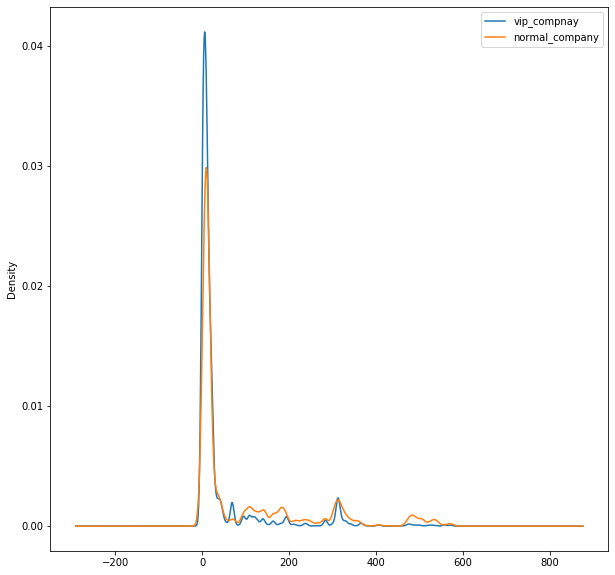


```python
m_purchase['S_koo'][m_purchase['점포코드']==2].value_counts().head()
```


    송파구    469264
    강남구     45506
    광진구     31431
    강동구     15396
    성동구     11155
    Name: S_koo, dtype: int64


```python
m_purchase['S_koo'][m_purchase['점포코드']==7].value_counts().head()
```


    송파구    635914
    강남구     36334
    강동구     18213
    광진구     15621
    성동구      8106
    Name: S_koo, dtype: int64


```python
m_purchase['S_koo'][m_purchase['점포코드']==20].value_counts().head()
```


    노원구    362214
    도봉구     97385
    강북구     11231
    중랑구      9725
    성북구      7383
    Name: S_koo, dtype: int64


```python
m_purchase['S_koo'][m_purchase['점포코드']==12].value_counts().head()
```


    강남구    262775
    강북구     87208
    송파구     25805
    서초구     17651
    도봉구      7202
    Name: S_koo, dtype: int64

- VIP고객이 대체로 송파구, 강남구에 거주하는 것으로 보아 해당 지역 근처에 있는 점포에 있는 것을 확인할 수 있다.

  

### 구매일자


```python
m_purchase['구매일자'].head()
```


    0    20140118
    1    20140203
    2    20140425
    3    20140425
    4    20140425
    Name: 구매일자, dtype: int64


```python
m_purchase['구매일자'].describe()
```


    count    8.181992e+06
    mean     2.014582e+07
    std      4.999929e+03
    min      2.014010e+07
    25%      2.014071e+07
    50%      2.015011e+07
    75%      2.015070e+07
    max      2.015123e+07
    Name: 구매일자, dtype: float64

- 2년치 데이터인 것을 알 수 있다.

  


```python
m_purchase['구매일자'] = pd.to_datetime(m_purchase['구매일자'], format='%Y%m%d')
m_purchase['구매일자'].head()
```


    0   2014-01-18
    1   2014-02-03
    2   2014-04-25
    3   2014-04-25
    4   2014-04-25
    Name: 구매일자, dtype: datetime64[ns]


```python
plt.figure(figsize=(8, 6))
plt.hist(m_purchase['구매일자'].sort_values(), bins=20)
```


    (array([363335., 369412., 398816., 389022., 416474., 409664., 405985.,
            392416., 403625., 416314., 412206., 418320., 432121., 438370.,
            442430., 454152., 424250., 392340., 393157., 409583.]),
     array([735234.  , 735270.45, 735306.9 , 735343.35, 735379.8 , 735416.25,
            735452.7 , 735489.15, 735525.6 , 735562.05, 735598.5 , 735634.95,
            735671.4 , 735707.85, 735744.3 , 735780.75, 735817.2 , 735853.65,
            735890.1 , 735926.55, 735963.  ]),
     <a list of 20 Patch objects>)


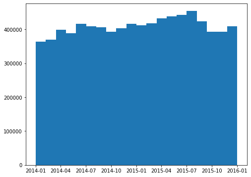


```python
pd.crosstab(m_purchase['구매일자'], m_purchase['VIP'], margins=True).sort_values([0], ascending=[False]).head()
```

<table border="1" class="dataframe">
  <thead>
    <tr style="text-align: right;">
      <th>VIP</th>
      <th>0</th>
      <th>1</th>
      <th>All</th>
    </tr>
    <tr>
      <th>구매일자</th>
      <th></th>
      <th></th>
      <th></th>
    </tr>
  </thead>
  <tbody>
    <tr>
      <td>All</td>
      <td>4802242</td>
      <td>3379750</td>
      <td>8181992</td>
    </tr>
    <tr>
      <td>2015-02-17 00:00:00</td>
      <td>10479</td>
      <td>7114</td>
      <td>17593</td>
    </tr>
    <tr>
      <td>2015-09-25 00:00:00</td>
      <td>10071</td>
      <td>7625</td>
      <td>17696</td>
    </tr>
    <tr>
      <td>2015-07-11 00:00:00</td>
      <td>10013</td>
      <td>6662</td>
      <td>16675</td>
    </tr>
    <tr>
      <td>2015-06-13 00:00:00</td>
      <td>9714</td>
      <td>5773</td>
      <td>15487</td>
    </tr>
  </tbody>
</table>


```python
pd.crosstab(m_purchase['구매일자'], m_purchase['VIP'], margins=True).sort_values([1], ascending=[False]).head()
```

<table border="1" class="dataframe">
  <thead>
    <tr style="text-align: right;">
      <th>VIP</th>
      <th>0</th>
      <th>1</th>
      <th>All</th>
    </tr>
    <tr>
      <th>구매일자</th>
      <th></th>
      <th></th>
      <th></th>
    </tr>
  </thead>
  <tbody>
    <tr>
      <td>All</td>
      <td>4802242</td>
      <td>3379750</td>
      <td>8181992</td>
    </tr>
    <tr>
      <td>2015-09-25 00:00:00</td>
      <td>10071</td>
      <td>7625</td>
      <td>17696</td>
    </tr>
    <tr>
      <td>2014-09-06 00:00:00</td>
      <td>9682</td>
      <td>7210</td>
      <td>16892</td>
    </tr>
    <tr>
      <td>2015-02-17 00:00:00</td>
      <td>10479</td>
      <td>7114</td>
      <td>17593</td>
    </tr>
    <tr>
      <td>2015-07-11 00:00:00</td>
      <td>10013</td>
      <td>6662</td>
      <td>16675</td>
    </tr>
  </tbody>
</table>
- 구매일자 데이터가 크게 VIP여부를 결정짓지 않는다는 것을 확인할 수 있었다.

  

### 구매시간


```python
m_purchase['구매시간'].value_counts().head()
```


    18    886515
    17    875135
    16    810246
    19    779266
    15    728724
    Name: 구매시간, dtype: int64


```python
plt.hist(m_purchase['구매시간'])
```


    (array([1.515000e+03, 1.150000e+02, 1.190000e+02, 2.695800e+04,
            6.436770e+05, 1.098510e+06, 2.190259e+06, 1.761650e+06,
            1.364804e+06, 1.094385e+06]),
     array([ 0. ,  2.3,  4.6,  6.9,  9.2, 11.5, 13.8, 16.1, 18.4, 20.7, 23. ]),
     <a list of 10 Patch objects>)


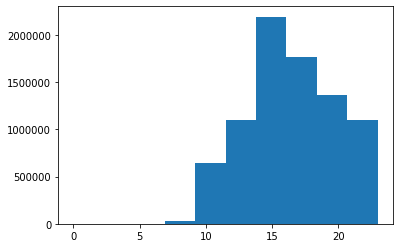


```python
pd.crosstab(m_purchase['구매시간'], m_purchase['VIP']).sort_values([0], ascending=[False]).head()
```

<table border="1" class="dataframe">
  <thead>
    <tr style="text-align: right;">
      <th>VIP</th>
      <th>0</th>
      <th>1</th>
    </tr>
    <tr>
      <th>구매시간</th>
      <th></th>
      <th></th>
    </tr>
  </thead>
  <tbody>
    <tr>
      <td>18</td>
      <td>534943</td>
      <td>351572</td>
    </tr>
    <tr>
      <td>17</td>
      <td>499038</td>
      <td>376097</td>
    </tr>
    <tr>
      <td>19</td>
      <td>464593</td>
      <td>314673</td>
    </tr>
    <tr>
      <td>16</td>
      <td>428006</td>
      <td>382240</td>
    </tr>
    <tr>
      <td>20</td>
      <td>390552</td>
      <td>194986</td>
    </tr>
  </tbody>
</table>
- VIP가 아닌 고객은 16시부터 20시에 이용이 몰려있으며, 18시에 가장 많은 고객이 이용한 것을 알 수 있다.

  


```python
pd.crosstab(m_purchase['구매시간'], m_purchase['VIP'], margins=True).sort_values([1], ascending=[False]).head()
```

<table border="1" class="dataframe">
  <thead>
    <tr style="text-align: right;">
      <th>VIP</th>
      <th>0</th>
      <th>1</th>
      <th>All</th>
    </tr>
    <tr>
      <th>구매시간</th>
      <th></th>
      <th></th>
      <th></th>
    </tr>
  </thead>
  <tbody>
    <tr>
      <td>All</td>
      <td>4802242</td>
      <td>3379750</td>
      <td>8181992</td>
    </tr>
    <tr>
      <td>16</td>
      <td>428006</td>
      <td>382240</td>
      <td>810246</td>
    </tr>
    <tr>
      <td>17</td>
      <td>499038</td>
      <td>376097</td>
      <td>875135</td>
    </tr>
    <tr>
      <td>15</td>
      <td>363692</td>
      <td>365032</td>
      <td>728724</td>
    </tr>
    <tr>
      <td>18</td>
      <td>534943</td>
      <td>351572</td>
      <td>886515</td>
    </tr>
  </tbody>
</table>
- VIP 고객은 14시부터 18시까지 이용이 몰려있으며, 16시에 가장 많은 고객이 이용한 것을 확인할 수 있다.

  


```python
vip_time = m_purchase['구매시간'][m_purchase['VIP'] == 1]
normal_time = m_purchase['구매시간'][m_purchase['VIP'] == 0]
```


```python
plt.figure(figsize =(10, 10))
vip_time.plot(kind='kde')
normal_time.plot(kind='kde')
plt.legend(['vip_compnay', 'normal_company'])
```


    <matplotlib.legend.Legend at 0x1ea50c41748>


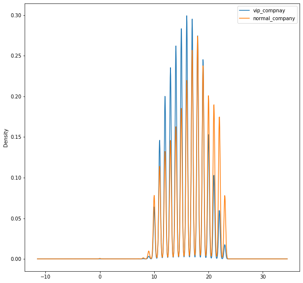


- 대체로 퇴근시간 후에 일반 고객의 이용이 증가하는 것을 알 수 있다.


```python
m_purchase.corr()["VIP"]
```

    고객번호     -0.226251
    거주지역      0.014232
    영수증번호    -0.183910
    대분류코드    -0.121919
    중분류코드    -0.121863
    점포코드     -0.207655
    구매일자     -0.008235
    구매시간     -0.149300
    구매금액      0.097607
    구매금액구간    0.191784
    VIP       1.000000
    Name: VIP, dtype: float64


## 3-3. product data


```python
df_product.head()
```

<table border="1" class="dataframe">
  <thead>
    <tr style="text-align: right;">
      <th></th>
      <th>제휴사</th>
      <th>대분류코드</th>
      <th>중분류코드</th>
      <th>소분류코드</th>
      <th>중분류명</th>
      <th>소분류명</th>
    </tr>
  </thead>
  <tbody>
    <tr>
      <td>0</td>
      <td>A</td>
      <td>1</td>
      <td>101</td>
      <td>A010101</td>
      <td>일용잡화</td>
      <td>위생세제</td>
    </tr>
    <tr>
      <td>1</td>
      <td>A</td>
      <td>1</td>
      <td>101</td>
      <td>A010102</td>
      <td>일용잡화</td>
      <td>휴지류</td>
    </tr>
    <tr>
      <td>2</td>
      <td>A</td>
      <td>1</td>
      <td>101</td>
      <td>A010103</td>
      <td>일용잡화</td>
      <td>뷰티상품</td>
    </tr>
    <tr>
      <td>3</td>
      <td>A</td>
      <td>1</td>
      <td>101</td>
      <td>A010104</td>
      <td>일용잡화</td>
      <td>일용잡화</td>
    </tr>
    <tr>
      <td>4</td>
      <td>A</td>
      <td>1</td>
      <td>101</td>
      <td>A010105</td>
      <td>일용잡화</td>
      <td>세트상품</td>
    </tr>
  </tbody>
</table>


```python
frame = { '제휴사': df_product['제휴사'], '중분류명': df_product['중분류명'], '소분류명':df_product['소분류명'] } 

df_product_name = pd.DataFrame(frame)
```


```python
df_product_name.groupby(df_product_name['제휴사']).describe()
```

<table border="1" class="dataframe">
  <thead>
    <tr>
      <th></th>
      <th colspan="4" halign="left">중분류명</th>
      <th colspan="4" halign="left">소분류명</th>
    </tr>
    <tr>
      <th></th>
      <th>count</th>
      <th>unique</th>
      <th>top</th>
      <th>freq</th>
      <th>count</th>
      <th>unique</th>
      <th>top</th>
      <th>freq</th>
    </tr>
    <tr>
      <th>제휴사</th>
      <th></th>
      <th></th>
      <th></th>
      <th></th>
      <th></th>
      <th></th>
      <th></th>
      <th></th>
    </tr>
  </thead>
  <tbody>
    <tr>
      <td>A</td>
      <td>630</td>
      <td>49</td>
      <td>스포츠</td>
      <td>79</td>
      <td>630</td>
      <td>617</td>
      <td>단기행사</td>
      <td>4</td>
    </tr>
    <tr>
      <td>B</td>
      <td>2624</td>
      <td>579</td>
      <td>열매채소</td>
      <td>26</td>
      <td>2624</td>
      <td>2294</td>
      <td>브랜드</td>
      <td>8</td>
    </tr>
    <tr>
      <td>C</td>
      <td>987</td>
      <td>98</td>
      <td>문화용품</td>
      <td>65</td>
      <td>987</td>
      <td>987</td>
      <td>섬유유연제/향기지속제</td>
      <td>1</td>
    </tr>
    <tr>
      <td>D</td>
      <td>145</td>
      <td>33</td>
      <td>음료</td>
      <td>23</td>
      <td>145</td>
      <td>145</td>
      <td>여성헤어액세서리</td>
      <td>1</td>
    </tr>
  </tbody>
</table>

- 여러가지 데이터를 보고 인터넷을 통해 알 수 있는 사실은
- A(롯데백화점), B(롯데마트), C(롯데슈퍼), D(LOHBs)
- 근거 : 영수증 별 가격 분포 / 점포수 / 취급물품


## 3-4. channel data


```python
s_df_channel[s_df_channel['고객번호'].duplicated()]
```

<table border="1" class="dataframe">
  <thead>
    <tr style="text-align: right;">
      <th></th>
      <th>고객번호</th>
      <th>성별</th>
      <th>연령대</th>
      <th>거주지역</th>
      <th>S_koo</th>
      <th>제휴사</th>
      <th>이용횟수</th>
    </tr>
  </thead>
  <tbody>
    <tr>
      <td>40</td>
      <td>74</td>
      <td>F</td>
      <td>60세이상</td>
      <td>55.0</td>
      <td>송파구</td>
      <td>B_MOBILE/APP</td>
      <td>30.0</td>
    </tr>
    <tr>
      <td>41</td>
      <td>74</td>
      <td>F</td>
      <td>60세이상</td>
      <td>55.0</td>
      <td>송파구</td>
      <td>B_ONLINEMALL</td>
      <td>11.0</td>
    </tr>
    <tr>
      <td>196</td>
      <td>376</td>
      <td>F</td>
      <td>60세이상</td>
      <td>24.0</td>
      <td>동대문구</td>
      <td>C_ONLINEMALL</td>
      <td>1.0</td>
    </tr>
    <tr>
      <td>216</td>
      <td>403</td>
      <td>M</td>
      <td>60세이상</td>
      <td>49.0</td>
      <td>광진구</td>
      <td>B_ONLINEMALL</td>
      <td>13.0</td>
    </tr>
    <tr>
      <td>222</td>
      <td>418</td>
      <td>F</td>
      <td>60세이상</td>
      <td>39.0</td>
      <td>마포구</td>
      <td>B_ONLINEMALL</td>
      <td>1.0</td>
    </tr>
    <tr>
      <td>...</td>
      <td>...</td>
      <td>...</td>
      <td>...</td>
      <td>...</td>
      <td>...</td>
      <td>...</td>
      <td>...</td>
    </tr>
    <tr>
      <td>6309</td>
      <td>18795</td>
      <td>F</td>
      <td>45세~49세</td>
      <td>33.0</td>
      <td>은평구</td>
      <td>C_ONLINEMALL</td>
      <td>15.0</td>
    </tr>
    <tr>
      <td>6311</td>
      <td>18799</td>
      <td>F</td>
      <td>20세~24세</td>
      <td>33.0</td>
      <td>은평구</td>
      <td>D_MOBILE/APP</td>
      <td>1.0</td>
    </tr>
    <tr>
      <td>6312</td>
      <td>18799</td>
      <td>F</td>
      <td>20세~24세</td>
      <td>33.0</td>
      <td>은평구</td>
      <td>B_ONLINEMALL</td>
      <td>1.0</td>
    </tr>
    <tr>
      <td>6361</td>
      <td>18932</td>
      <td>F</td>
      <td>40세~44세</td>
      <td>55.0</td>
      <td>송파구</td>
      <td>B_MOBILE/APP</td>
      <td>1.0</td>
    </tr>
    <tr>
      <td>6466</td>
      <td>19312</td>
      <td>F</td>
      <td>35세~39세</td>
      <td>43.0</td>
      <td>용산구</td>
      <td>B_ONLINEMALL</td>
      <td>137.0</td>
    </tr>
  </tbody>
</table>
<p>649 rows × 7 columns</p>
```python
s_df_channel.shape
```


    (6490, 7)


```python
s_df_channel.isnull().sum()
```


    고객번호        0
    성별          0
    연령대         0
    거주지역        0
    S_koo       0
    제휴사      4042
    이용횟수     4042
    dtype: int64

- 전체 데이터 8824개 중 4042의 서울시 고객만이 모바일이나 웹페이지를 이용하지 않은 것을 확인할 수 있다.

- 총 5841명 중 대다수가 이용하지 않는다는 사실을 알 수 있다.

  


```python
# 고객번호 기준의 데이터로 변경하기 위해 새로운 데이터 프레임 생성
cust_num =s_df_channel['고객번호']
null_partner = s_df_channel['제휴사']
null_used = s_df_channel['이용횟수']

frame = { '고객번호': cust_num, '제휴사': null_partner, '이용횟수': null_used } 

null_channel = pd.DataFrame(frame)
null_channel.head()
```

<table border="1" class="dataframe">
  <thead>
    <tr style="text-align: right;">
      <th></th>
      <th>고객번호</th>
      <th>제휴사</th>
      <th>이용횟수</th>
    </tr>
  </thead>
  <tbody>
    <tr>
      <td>0</td>
      <td>1</td>
      <td>NaN</td>
      <td>NaN</td>
    </tr>
    <tr>
      <td>1</td>
      <td>3</td>
      <td>NaN</td>
      <td>NaN</td>
    </tr>
    <tr>
      <td>2</td>
      <td>4</td>
      <td>NaN</td>
      <td>NaN</td>
    </tr>
    <tr>
      <td>3</td>
      <td>7</td>
      <td>A_MOBILE/APP</td>
      <td>4.0</td>
    </tr>
    <tr>
      <td>4</td>
      <td>8</td>
      <td>NaN</td>
      <td>NaN</td>
    </tr>
  </tbody>
</table>


```python
# 제휴사에 대한 가변수 생성
channel_use = pd.get_dummies(null_channel['제휴사'], prefix='CH')
channel_use.head()
```

<table border="1" class="dataframe">
  <thead>
    <tr style="text-align: right;">
      <th></th>
      <th>CH_A_MOBILE/APP</th>
      <th>CH_B_MOBILE/APP</th>
      <th>CH_B_ONLINEMALL</th>
      <th>CH_C_MOBILE/APP</th>
      <th>CH_C_ONLINEMALL</th>
      <th>CH_D_MOBILE/APP</th>
    </tr>
  </thead>
  <tbody>
    <tr>
      <td>0</td>
      <td>0</td>
      <td>0</td>
      <td>0</td>
      <td>0</td>
      <td>0</td>
      <td>0</td>
    </tr>
    <tr>
      <td>1</td>
      <td>0</td>
      <td>0</td>
      <td>0</td>
      <td>0</td>
      <td>0</td>
      <td>0</td>
    </tr>
    <tr>
      <td>2</td>
      <td>0</td>
      <td>0</td>
      <td>0</td>
      <td>0</td>
      <td>0</td>
      <td>0</td>
    </tr>
    <tr>
      <td>3</td>
      <td>1</td>
      <td>0</td>
      <td>0</td>
      <td>0</td>
      <td>0</td>
      <td>0</td>
    </tr>
    <tr>
      <td>4</td>
      <td>0</td>
      <td>0</td>
      <td>0</td>
      <td>0</td>
      <td>0</td>
      <td>0</td>
    </tr>
  </tbody>
</table>


```python
# 생성한 가변수와 고객번호 데이터와 병합
m_channel = pd.concat([null_channel, channel_use], axis=1)
m_channel = pd.concat([m_channel['고객번호'], m_channel['이용횟수'], m_channel.iloc[:,3:]], axis=1)

m_channel['이용횟수'].fillna(0, inplace = True)

for series in m_channel.columns:
    if (series != '고객번호') and (series !='이용횟수'):
        m_channel[series] = m_channel[series] * m_channel['이용횟수']

m_channel.drop(['이용횟수'], axis='columns',inplace=True)

m_channel.head()
```

<table border="1" class="dataframe">
  <thead>
    <tr style="text-align: right;">
      <th></th>
      <th>고객번호</th>
      <th>CH_A_MOBILE/APP</th>
      <th>CH_B_MOBILE/APP</th>
      <th>CH_B_ONLINEMALL</th>
      <th>CH_C_MOBILE/APP</th>
      <th>CH_C_ONLINEMALL</th>
      <th>CH_D_MOBILE/APP</th>
    </tr>
  </thead>
  <tbody>
    <tr>
      <td>0</td>
      <td>1</td>
      <td>0.0</td>
      <td>0.0</td>
      <td>0.0</td>
      <td>0.0</td>
      <td>0.0</td>
      <td>0.0</td>
    </tr>
    <tr>
      <td>1</td>
      <td>3</td>
      <td>0.0</td>
      <td>0.0</td>
      <td>0.0</td>
      <td>0.0</td>
      <td>0.0</td>
      <td>0.0</td>
    </tr>
    <tr>
      <td>2</td>
      <td>4</td>
      <td>0.0</td>
      <td>0.0</td>
      <td>0.0</td>
      <td>0.0</td>
      <td>0.0</td>
      <td>0.0</td>
    </tr>
    <tr>
      <td>3</td>
      <td>7</td>
      <td>4.0</td>
      <td>0.0</td>
      <td>0.0</td>
      <td>0.0</td>
      <td>0.0</td>
      <td>0.0</td>
    </tr>
    <tr>
      <td>4</td>
      <td>8</td>
      <td>0.0</td>
      <td>0.0</td>
      <td>0.0</td>
      <td>0.0</td>
      <td>0.0</td>
      <td>0.0</td>
    </tr>
  </tbody>
</table>


# 4. Data Preprocessing

  

## 4-1. Clustering
* 고객의 구매 내역 데이터에서 (구매빈도, 구매시간, 구매금액) 기준으로 clustering 진행
* KMeans, 계층적군집분석, DBSCAN 시도 예정
* KMeans cluster 데이터 분포가 적절하여 해당 방식 이용


```python
# 구매빈도
df_stuff_cnt = m_purchase['소분류코드'].groupby(m_purchase['소분류코드']).count()
# 구매시간
df_stuff_time = m_purchase['구매시간'].groupby(m_purchase['소분류코드']).mean()
# 구매금액
df_stuff_amt = m_purchase['구매금액'].groupby(m_purchase['소분류코드']).mean()

frame1 = { '구매빈도': df_stuff_cnt, '구매시간': df_stuff_time, '구매금액':df_stuff_amt } 

df_stuff = pd.DataFrame(frame1)
df_stuff.head()
```

<table border="1" class="dataframe">
  <thead>
    <tr style="text-align: right;">
      <th></th>
      <th>구매빈도</th>
      <th>구매시간</th>
      <th>구매금액</th>
    </tr>
    <tr>
      <th>소분류코드</th>
      <th></th>
      <th></th>
      <th></th>
    </tr>
  </thead>
  <tbody>
    <tr>
      <td>A010101</td>
      <td>42967</td>
      <td>15.565713</td>
      <td>11711.757395</td>
    </tr>
    <tr>
      <td>A010102</td>
      <td>3</td>
      <td>15.666667</td>
      <td>2233.333333</td>
    </tr>
    <tr>
      <td>A010103</td>
      <td>14550</td>
      <td>15.617045</td>
      <td>17685.999313</td>
    </tr>
    <tr>
      <td>A010104</td>
      <td>10186</td>
      <td>15.512763</td>
      <td>4964.707442</td>
    </tr>
    <tr>
      <td>A010105</td>
      <td>173</td>
      <td>15.346821</td>
      <td>147356.647399</td>
    </tr>
  </tbody>
</table>


### KMeans


```python
feature = df_stuff[ ['구매빈도', '구매시간', '구매금액']]
```


```python
# 적절한 cluster 수 확인 (but 편차때문에 강제로 늘려버림 5 -> 10개)
ks = range(1,20)
inertias = []

for k in ks:
    model = KMeans(n_clusters=k)
    model.fit(feature)
    inertias.append(model.inertia_)

# Plot ks vs inertias
plt.plot(ks, inertias, '-o')
plt.xlabel('number of clusters, k')
plt.ylabel('inertia')
plt.xticks(ks)
plt.show()
```


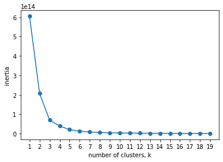


```python
# 정규표준화, KMeans, 파이프라인 선언
scaler = StandardScaler()
model = KMeans(n_clusters=10)
pipeline = make_pipeline(scaler,model)
```


```python
# 파이프라인을 이용하여 정규표준화 한 뒤 KMeans 학습
pipeline.fit(feature)
predict = pd.DataFrame(pipeline.predict(feature))
predict.columns=['predict']
```


```python
# clustring 결과의 분포가 적절히 이루어진 것을 확인할 수 있다.
predict['predict'].value_counts()
```


    0    1848
    3    1009
    5     739
    7     280
    8     126
    4      53
    9      46
    6      22
    2      13
    1       1
    Name: predict, dtype: int64


```python
# clustring 데이터와 결과값 데이터를 합침
predict = predict.set_index(feature.index)
r = pd.concat([feature,predict],axis=1)
r.head()
```

<table border="1" class="dataframe">
  <thead>
    <tr style="text-align: right;">
      <th></th>
      <th>구매빈도</th>
      <th>구매시간</th>
      <th>구매금액</th>
      <th>predict</th>
    </tr>
    <tr>
      <th>소분류코드</th>
      <th></th>
      <th></th>
      <th></th>
      <th></th>
    </tr>
  </thead>
  <tbody>
    <tr>
      <td>A010101</td>
      <td>42967</td>
      <td>15.565713</td>
      <td>11711.757395</td>
      <td>4</td>
    </tr>
    <tr>
      <td>A010102</td>
      <td>3</td>
      <td>15.666667</td>
      <td>2233.333333</td>
      <td>5</td>
    </tr>
    <tr>
      <td>A010103</td>
      <td>14550</td>
      <td>15.617045</td>
      <td>17685.999313</td>
      <td>7</td>
    </tr>
    <tr>
      <td>A010104</td>
      <td>10186</td>
      <td>15.512763</td>
      <td>4964.707442</td>
      <td>7</td>
    </tr>
    <tr>
      <td>A010105</td>
      <td>173</td>
      <td>15.346821</td>
      <td>147356.647399</td>
      <td>5</td>
    </tr>
  </tbody>
</table>


```python
# KMeans 결과값 저장
r.to_csv('./data/r_KMeans.csv')
```

  


## 4-2. Clustering Data Convert


```python
product_code = m_purchase['소분류코드']
customer_no = m_purchase['고객번호']

frame2 = { '소분류코드': product_code, '고객번호': customer_no} 

pur_product = pd.DataFrame(frame2)
pur_product.head()
```

<table border="1" class="dataframe">
  <thead>
    <tr style="text-align: right;">
      <th></th>
      <th>소분류코드</th>
      <th>고객번호</th>
    </tr>
  </thead>
  <tbody>
    <tr>
      <td>0</td>
      <td>A020105</td>
      <td>1</td>
    </tr>
    <tr>
      <td>1</td>
      <td>A040214</td>
      <td>1</td>
    </tr>
    <tr>
      <td>2</td>
      <td>A010302</td>
      <td>1</td>
    </tr>
    <tr>
      <td>3</td>
      <td>A010404</td>
      <td>1</td>
    </tr>
    <tr>
      <td>4</td>
      <td>A010501</td>
      <td>1</td>
    </tr>
  </tbody>
</table>


```python
# 구매데이터의 소분류코드, 고객번호와 제품데이터의 clustring 결과값을 merge
pur_prod = pd.merge(pur_product, r['predict'].reset_index(), how='left')
pur_prod.head()
```

<table border="1" class="dataframe">
  <thead>
    <tr style="text-align: right;">
      <th></th>
      <th>소분류코드</th>
      <th>고객번호</th>
      <th>predict</th>
    </tr>
  </thead>
  <tbody>
    <tr>
      <td>0</td>
      <td>A020105</td>
      <td>1</td>
      <td>7</td>
    </tr>
    <tr>
      <td>1</td>
      <td>A040214</td>
      <td>1</td>
      <td>7</td>
    </tr>
    <tr>
      <td>2</td>
      <td>A010302</td>
      <td>1</td>
      <td>2</td>
    </tr>
    <tr>
      <td>3</td>
      <td>A010404</td>
      <td>1</td>
      <td>2</td>
    </tr>
    <tr>
      <td>4</td>
      <td>A010501</td>
      <td>1</td>
      <td>4</td>
    </tr>
  </tbody>
</table>


```python
# cluster에 대한 가변수 생성
cluster_dumm = pd.get_dummies(pur_prod['predict'], prefix='cluster_product')
cluster_dumm.head()
```

<table border="1" class="dataframe">
  <thead>
    <tr style="text-align: right;">
      <th></th>
      <th>cluster_product_0</th>
      <th>cluster_product_1</th>
      <th>cluster_product_2</th>
      <th>cluster_product_3</th>
      <th>cluster_product_4</th>
      <th>cluster_product_5</th>
      <th>cluster_product_6</th>
      <th>cluster_product_7</th>
      <th>cluster_product_8</th>
      <th>cluster_product_9</th>
    </tr>
  </thead>
  <tbody>
    <tr>
      <td>0</td>
      <td>0</td>
      <td>0</td>
      <td>0</td>
      <td>0</td>
      <td>0</td>
      <td>0</td>
      <td>0</td>
      <td>1</td>
      <td>0</td>
      <td>0</td>
    </tr>
    <tr>
      <td>1</td>
      <td>0</td>
      <td>0</td>
      <td>0</td>
      <td>0</td>
      <td>0</td>
      <td>0</td>
      <td>0</td>
      <td>1</td>
      <td>0</td>
      <td>0</td>
    </tr>
    <tr>
      <td>2</td>
      <td>0</td>
      <td>0</td>
      <td>1</td>
      <td>0</td>
      <td>0</td>
      <td>0</td>
      <td>0</td>
      <td>0</td>
      <td>0</td>
      <td>0</td>
    </tr>
    <tr>
      <td>3</td>
      <td>0</td>
      <td>0</td>
      <td>1</td>
      <td>0</td>
      <td>0</td>
      <td>0</td>
      <td>0</td>
      <td>0</td>
      <td>0</td>
      <td>0</td>
    </tr>
    <tr>
      <td>4</td>
      <td>0</td>
      <td>0</td>
      <td>0</td>
      <td>0</td>
      <td>1</td>
      <td>0</td>
      <td>0</td>
      <td>0</td>
      <td>0</td>
      <td>0</td>
    </tr>
  </tbody>
</table>


```python
purchase_product = pd.concat([pur_prod,cluster_dumm],axis=1)
purchase_product = pd.concat([purchase_product['고객번호'], purchase_product.iloc[:,3:]], axis=1)
purchase_product.head()
```

<table border="1" class="dataframe">
  <thead>
    <tr style="text-align: right;">
      <th></th>
      <th>고객번호</th>
      <th>cluster_product_0</th>
      <th>cluster_product_1</th>
      <th>cluster_product_2</th>
      <th>cluster_product_3</th>
      <th>cluster_product_4</th>
      <th>cluster_product_5</th>
      <th>cluster_product_6</th>
      <th>cluster_product_7</th>
      <th>cluster_product_8</th>
      <th>cluster_product_9</th>
    </tr>
  </thead>
  <tbody>
    <tr>
      <td>0</td>
      <td>1</td>
      <td>0</td>
      <td>0</td>
      <td>0</td>
      <td>0</td>
      <td>0</td>
      <td>0</td>
      <td>0</td>
      <td>1</td>
      <td>0</td>
      <td>0</td>
    </tr>
    <tr>
      <td>1</td>
      <td>1</td>
      <td>0</td>
      <td>0</td>
      <td>0</td>
      <td>0</td>
      <td>0</td>
      <td>0</td>
      <td>0</td>
      <td>1</td>
      <td>0</td>
      <td>0</td>
    </tr>
    <tr>
      <td>2</td>
      <td>1</td>
      <td>0</td>
      <td>0</td>
      <td>1</td>
      <td>0</td>
      <td>0</td>
      <td>0</td>
      <td>0</td>
      <td>0</td>
      <td>0</td>
      <td>0</td>
    </tr>
    <tr>
      <td>3</td>
      <td>1</td>
      <td>0</td>
      <td>0</td>
      <td>1</td>
      <td>0</td>
      <td>0</td>
      <td>0</td>
      <td>0</td>
      <td>0</td>
      <td>0</td>
      <td>0</td>
    </tr>
    <tr>
      <td>4</td>
      <td>1</td>
      <td>0</td>
      <td>0</td>
      <td>0</td>
      <td>0</td>
      <td>1</td>
      <td>0</td>
      <td>0</td>
      <td>0</td>
      <td>0</td>
      <td>0</td>
    </tr>
  </tbody>
</table>


```python
# 고객별 제품cluster 구매 횟수
m_cluster = purchase_product.groupby(purchase_product['고객번호']).sum()
m_cluster = m_cluster.reset_index()
m_cluster.head()
```

<table border="1" class="dataframe">
  <thead>
    <tr style="text-align: right;">
      <th></th>
      <th>고객번호</th>
      <th>cluster_product_0</th>
      <th>cluster_product_1</th>
      <th>cluster_product_2</th>
      <th>cluster_product_3</th>
      <th>cluster_product_4</th>
      <th>cluster_product_5</th>
      <th>cluster_product_6</th>
      <th>cluster_product_7</th>
      <th>cluster_product_8</th>
      <th>cluster_product_9</th>
    </tr>
  </thead>
  <tbody>
    <tr>
      <td>0</td>
      <td>1</td>
      <td>46.0</td>
      <td>0.0</td>
      <td>266.0</td>
      <td>9.0</td>
      <td>215.0</td>
      <td>202.0</td>
      <td>5.0</td>
      <td>314.0</td>
      <td>0.0</td>
      <td>0.0</td>
    </tr>
    <tr>
      <td>1</td>
      <td>3</td>
      <td>161.0</td>
      <td>0.0</td>
      <td>81.0</td>
      <td>26.0</td>
      <td>662.0</td>
      <td>20.0</td>
      <td>0.0</td>
      <td>241.0</td>
      <td>0.0</td>
      <td>0.0</td>
    </tr>
    <tr>
      <td>2</td>
      <td>4</td>
      <td>116.0</td>
      <td>0.0</td>
      <td>201.0</td>
      <td>22.0</td>
      <td>189.0</td>
      <td>126.0</td>
      <td>0.0</td>
      <td>276.0</td>
      <td>0.0</td>
      <td>0.0</td>
    </tr>
    <tr>
      <td>3</td>
      <td>7</td>
      <td>114.0</td>
      <td>0.0</td>
      <td>94.0</td>
      <td>18.0</td>
      <td>209.0</td>
      <td>162.0</td>
      <td>1.0</td>
      <td>183.0</td>
      <td>0.0</td>
      <td>0.0</td>
    </tr>
    <tr>
      <td>4</td>
      <td>8</td>
      <td>54.0</td>
      <td>0.0</td>
      <td>998.0</td>
      <td>20.0</td>
      <td>315.0</td>
      <td>184.0</td>
      <td>8.0</td>
      <td>286.0</td>
      <td>0.0</td>
      <td>0.0</td>
    </tr>
  </tbody>
</table>


```python
# 고객별 제품cluster csv파일로 저장
m_cluster.to_csv('./data/cust_KMeans.csv')
```

 


## 4-3. Merge DataFrame


```python
m_client.head()
```

<table border="1" class="dataframe">
  <thead>
    <tr style="text-align: right;">
      <th></th>
      <th>고객번호</th>
      <th>성별</th>
      <th>연령대</th>
      <th>거주지역</th>
      <th>S_koo</th>
      <th>구매금액</th>
      <th>구매금액_1년</th>
      <th>구매금액구간</th>
      <th>VIP</th>
    </tr>
  </thead>
  <tbody>
    <tr>
      <td>0</td>
      <td>1</td>
      <td>0</td>
      <td>6.0</td>
      <td>60.0</td>
      <td>강남구</td>
      <td>85042550</td>
      <td>42521275</td>
      <td>1</td>
      <td>1</td>
    </tr>
    <tr>
      <td>1</td>
      <td>3</td>
      <td>0</td>
      <td>6.0</td>
      <td>33.0</td>
      <td>은평구</td>
      <td>3165167</td>
      <td>1582583</td>
      <td>1</td>
      <td>0</td>
    </tr>
    <tr>
      <td>2</td>
      <td>4</td>
      <td>1</td>
      <td>6.0</td>
      <td>16.0</td>
      <td>노원구</td>
      <td>16693810</td>
      <td>8346905</td>
      <td>1</td>
      <td>0</td>
    </tr>
    <tr>
      <td>3</td>
      <td>7</td>
      <td>1</td>
      <td>6.0</td>
      <td>36.0</td>
      <td>서대문구</td>
      <td>73726276</td>
      <td>36863138</td>
      <td>1</td>
      <td>1</td>
    </tr>
    <tr>
      <td>4</td>
      <td>8</td>
      <td>0</td>
      <td>6.0</td>
      <td>10.0</td>
      <td>강북구</td>
      <td>62355952</td>
      <td>31177976</td>
      <td>1</td>
      <td>1</td>
    </tr>
  </tbody>
</table>


```python
m_purchase.head()
```

<table border="1" class="dataframe">
  <thead>
    <tr style="text-align: right;">
      <th></th>
      <th>고객번호</th>
      <th>성별</th>
      <th>연령대</th>
      <th>거주지역</th>
      <th>S_koo</th>
      <th>제휴사</th>
      <th>영수증번호</th>
      <th>대분류코드</th>
      <th>중분류코드</th>
      <th>소분류코드</th>
      <th>점포코드</th>
      <th>구매일자</th>
      <th>구매시간</th>
      <th>구매금액</th>
      <th>구매금액구간</th>
      <th>VIP</th>
    </tr>
  </thead>
  <tbody>
    <tr>
      <td>0</td>
      <td>1</td>
      <td>M</td>
      <td>60세이상</td>
      <td>60.0</td>
      <td>강남구</td>
      <td>0</td>
      <td>1239451</td>
      <td>2</td>
      <td>201</td>
      <td>A020105</td>
      <td>12</td>
      <td>2014-01-18</td>
      <td>15</td>
      <td>10000</td>
      <td>1</td>
      <td>1</td>
    </tr>
    <tr>
      <td>1</td>
      <td>1</td>
      <td>M</td>
      <td>60세이상</td>
      <td>60.0</td>
      <td>강남구</td>
      <td>0</td>
      <td>1319908</td>
      <td>4</td>
      <td>402</td>
      <td>A040214</td>
      <td>20</td>
      <td>2014-02-03</td>
      <td>15</td>
      <td>129000</td>
      <td>1</td>
      <td>1</td>
    </tr>
    <tr>
      <td>2</td>
      <td>1</td>
      <td>M</td>
      <td>60세이상</td>
      <td>60.0</td>
      <td>강남구</td>
      <td>0</td>
      <td>1807440</td>
      <td>1</td>
      <td>103</td>
      <td>A010302</td>
      <td>12</td>
      <td>2014-04-25</td>
      <td>12</td>
      <td>7000</td>
      <td>1</td>
      <td>1</td>
    </tr>
    <tr>
      <td>3</td>
      <td>1</td>
      <td>M</td>
      <td>60세이상</td>
      <td>60.0</td>
      <td>강남구</td>
      <td>0</td>
      <td>1807440</td>
      <td>1</td>
      <td>104</td>
      <td>A010404</td>
      <td>12</td>
      <td>2014-04-25</td>
      <td>12</td>
      <td>2650</td>
      <td>1</td>
      <td>1</td>
    </tr>
    <tr>
      <td>4</td>
      <td>1</td>
      <td>M</td>
      <td>60세이상</td>
      <td>60.0</td>
      <td>강남구</td>
      <td>0</td>
      <td>1807440</td>
      <td>1</td>
      <td>105</td>
      <td>A010501</td>
      <td>12</td>
      <td>2014-04-25</td>
      <td>12</td>
      <td>9800</td>
      <td>1</td>
      <td>1</td>
    </tr>
  </tbody>
</table>


```python
m_channel.head()
```

<table border="1" class="dataframe">
  <thead>
    <tr style="text-align: right;">
      <th></th>
      <th>고객번호</th>
      <th>CH_A_MOBILE/APP</th>
      <th>CH_B_MOBILE/APP</th>
      <th>CH_B_ONLINEMALL</th>
      <th>CH_C_MOBILE/APP</th>
      <th>CH_C_ONLINEMALL</th>
      <th>CH_D_MOBILE/APP</th>
    </tr>
  </thead>
  <tbody>
    <tr>
      <td>0</td>
      <td>1</td>
      <td>0.0</td>
      <td>0.0</td>
      <td>0.0</td>
      <td>0.0</td>
      <td>0.0</td>
      <td>0.0</td>
    </tr>
    <tr>
      <td>1</td>
      <td>3</td>
      <td>0.0</td>
      <td>0.0</td>
      <td>0.0</td>
      <td>0.0</td>
      <td>0.0</td>
      <td>0.0</td>
    </tr>
    <tr>
      <td>2</td>
      <td>4</td>
      <td>0.0</td>
      <td>0.0</td>
      <td>0.0</td>
      <td>0.0</td>
      <td>0.0</td>
      <td>0.0</td>
    </tr>
    <tr>
      <td>3</td>
      <td>7</td>
      <td>4.0</td>
      <td>0.0</td>
      <td>0.0</td>
      <td>0.0</td>
      <td>0.0</td>
      <td>0.0</td>
    </tr>
    <tr>
      <td>4</td>
      <td>8</td>
      <td>0.0</td>
      <td>0.0</td>
      <td>0.0</td>
      <td>0.0</td>
      <td>0.0</td>
      <td>0.0</td>
    </tr>
  </tbody>
</table>


```python
m_cluster.head()
```

<table border="1" class="dataframe">
  <thead>
    <tr style="text-align: right;">
      <th></th>
      <th>고객번호</th>
      <th>cluster_product_0</th>
      <th>cluster_product_1</th>
      <th>cluster_product_2</th>
      <th>cluster_product_3</th>
      <th>cluster_product_4</th>
      <th>cluster_product_5</th>
      <th>cluster_product_6</th>
      <th>cluster_product_7</th>
      <th>cluster_product_8</th>
      <th>cluster_product_9</th>
    </tr>
  </thead>
  <tbody>
    <tr>
      <td>0</td>
      <td>1</td>
      <td>46.0</td>
      <td>0.0</td>
      <td>266.0</td>
      <td>9.0</td>
      <td>215.0</td>
      <td>202.0</td>
      <td>5.0</td>
      <td>314.0</td>
      <td>0.0</td>
      <td>0.0</td>
    </tr>
    <tr>
      <td>1</td>
      <td>3</td>
      <td>161.0</td>
      <td>0.0</td>
      <td>81.0</td>
      <td>26.0</td>
      <td>662.0</td>
      <td>20.0</td>
      <td>0.0</td>
      <td>241.0</td>
      <td>0.0</td>
      <td>0.0</td>
    </tr>
    <tr>
      <td>2</td>
      <td>4</td>
      <td>116.0</td>
      <td>0.0</td>
      <td>201.0</td>
      <td>22.0</td>
      <td>189.0</td>
      <td>126.0</td>
      <td>0.0</td>
      <td>276.0</td>
      <td>0.0</td>
      <td>0.0</td>
    </tr>
    <tr>
      <td>3</td>
      <td>7</td>
      <td>114.0</td>
      <td>0.0</td>
      <td>94.0</td>
      <td>18.0</td>
      <td>209.0</td>
      <td>162.0</td>
      <td>1.0</td>
      <td>183.0</td>
      <td>0.0</td>
      <td>0.0</td>
    </tr>
    <tr>
      <td>4</td>
      <td>8</td>
      <td>54.0</td>
      <td>0.0</td>
      <td>998.0</td>
      <td>20.0</td>
      <td>315.0</td>
      <td>184.0</td>
      <td>8.0</td>
      <td>286.0</td>
      <td>0.0</td>
      <td>0.0</td>
    </tr>
  </tbody>
</table>


```python
df_merge = pd.merge(m_client, m_channel, how='left')
df_merge = pd.merge(df_merge, m_cluster, how='left')
df_merge.drop(['S_koo', '구매금액', '구매금액_1년', '구매금액구간'], axis='columns', inplace=True)
df_merge.head().transpose()
```

<table border="1" class="dataframe">
  <thead>
    <tr style="text-align: right;">
      <th></th>
      <th>0</th>
      <th>1</th>
      <th>2</th>
      <th>3</th>
      <th>4</th>
    </tr>
  </thead>
  <tbody>
    <tr>
      <td>고객번호</td>
      <td>1.0</td>
      <td>3.0</td>
      <td>4.0</td>
      <td>7.0</td>
      <td>8.0</td>
    </tr>
    <tr>
      <td>성별</td>
      <td>0.0</td>
      <td>0.0</td>
      <td>1.0</td>
      <td>1.0</td>
      <td>0.0</td>
    </tr>
    <tr>
      <td>연령대</td>
      <td>6.0</td>
      <td>6.0</td>
      <td>6.0</td>
      <td>6.0</td>
      <td>6.0</td>
    </tr>
    <tr>
      <td>거주지역</td>
      <td>60.0</td>
      <td>33.0</td>
      <td>16.0</td>
      <td>36.0</td>
      <td>10.0</td>
    </tr>
    <tr>
      <td>VIP</td>
      <td>1.0</td>
      <td>0.0</td>
      <td>0.0</td>
      <td>1.0</td>
      <td>1.0</td>
    </tr>
    <tr>
      <td>CH_A_MOBILE/APP</td>
      <td>0.0</td>
      <td>0.0</td>
      <td>0.0</td>
      <td>4.0</td>
      <td>0.0</td>
    </tr>
    <tr>
      <td>CH_B_MOBILE/APP</td>
      <td>0.0</td>
      <td>0.0</td>
      <td>0.0</td>
      <td>0.0</td>
      <td>0.0</td>
    </tr>
    <tr>
      <td>CH_B_ONLINEMALL</td>
      <td>0.0</td>
      <td>0.0</td>
      <td>0.0</td>
      <td>0.0</td>
      <td>0.0</td>
    </tr>
    <tr>
      <td>CH_C_MOBILE/APP</td>
      <td>0.0</td>
      <td>0.0</td>
      <td>0.0</td>
      <td>0.0</td>
      <td>0.0</td>
    </tr>
    <tr>
      <td>CH_C_ONLINEMALL</td>
      <td>0.0</td>
      <td>0.0</td>
      <td>0.0</td>
      <td>0.0</td>
      <td>0.0</td>
    </tr>
    <tr>
      <td>CH_D_MOBILE/APP</td>
      <td>0.0</td>
      <td>0.0</td>
      <td>0.0</td>
      <td>0.0</td>
      <td>0.0</td>
    </tr>
    <tr>
      <td>cluster_product_0</td>
      <td>46.0</td>
      <td>161.0</td>
      <td>116.0</td>
      <td>114.0</td>
      <td>54.0</td>
    </tr>
    <tr>
      <td>cluster_product_1</td>
      <td>0.0</td>
      <td>0.0</td>
      <td>0.0</td>
      <td>0.0</td>
      <td>0.0</td>
    </tr>
    <tr>
      <td>cluster_product_2</td>
      <td>266.0</td>
      <td>81.0</td>
      <td>201.0</td>
      <td>94.0</td>
      <td>998.0</td>
    </tr>
    <tr>
      <td>cluster_product_3</td>
      <td>9.0</td>
      <td>26.0</td>
      <td>22.0</td>
      <td>18.0</td>
      <td>20.0</td>
    </tr>
    <tr>
      <td>cluster_product_4</td>
      <td>215.0</td>
      <td>662.0</td>
      <td>189.0</td>
      <td>209.0</td>
      <td>315.0</td>
    </tr>
    <tr>
      <td>cluster_product_5</td>
      <td>202.0</td>
      <td>20.0</td>
      <td>126.0</td>
      <td>162.0</td>
      <td>184.0</td>
    </tr>
    <tr>
      <td>cluster_product_6</td>
      <td>5.0</td>
      <td>0.0</td>
      <td>0.0</td>
      <td>1.0</td>
      <td>8.0</td>
    </tr>
    <tr>
      <td>cluster_product_7</td>
      <td>314.0</td>
      <td>241.0</td>
      <td>276.0</td>
      <td>183.0</td>
      <td>286.0</td>
    </tr>
    <tr>
      <td>cluster_product_8</td>
      <td>0.0</td>
      <td>0.0</td>
      <td>0.0</td>
      <td>0.0</td>
      <td>0.0</td>
    </tr>
    <tr>
      <td>cluster_product_9</td>
      <td>0.0</td>
      <td>0.0</td>
      <td>0.0</td>
      <td>0.0</td>
      <td>0.0</td>
    </tr>
  </tbody>
</table>


```python
# 순서 변경
target = df_merge['VIP']
X = df_merge.drop(['VIP'], axis='columns')
df_merge = pd.concat([X, target], axis=1)
df_merge.head().transpose()
```

<table border="1" class="dataframe">
  <thead>
    <tr style="text-align: right;">
      <th></th>
      <th>0</th>
      <th>1</th>
      <th>2</th>
      <th>3</th>
      <th>4</th>
    </tr>
  </thead>
  <tbody>
    <tr>
      <td>고객번호</td>
      <td>1.0</td>
      <td>3.0</td>
      <td>4.0</td>
      <td>7.0</td>
      <td>8.0</td>
    </tr>
    <tr>
      <td>성별</td>
      <td>0.0</td>
      <td>0.0</td>
      <td>1.0</td>
      <td>1.0</td>
      <td>0.0</td>
    </tr>
    <tr>
      <td>연령대</td>
      <td>6.0</td>
      <td>6.0</td>
      <td>6.0</td>
      <td>6.0</td>
      <td>6.0</td>
    </tr>
    <tr>
      <td>거주지역</td>
      <td>60.0</td>
      <td>33.0</td>
      <td>16.0</td>
      <td>36.0</td>
      <td>10.0</td>
    </tr>
    <tr>
      <td>CH_A_MOBILE/APP</td>
      <td>0.0</td>
      <td>0.0</td>
      <td>0.0</td>
      <td>4.0</td>
      <td>0.0</td>
    </tr>
    <tr>
      <td>CH_B_MOBILE/APP</td>
      <td>0.0</td>
      <td>0.0</td>
      <td>0.0</td>
      <td>0.0</td>
      <td>0.0</td>
    </tr>
    <tr>
      <td>CH_B_ONLINEMALL</td>
      <td>0.0</td>
      <td>0.0</td>
      <td>0.0</td>
      <td>0.0</td>
      <td>0.0</td>
    </tr>
    <tr>
      <td>CH_C_MOBILE/APP</td>
      <td>0.0</td>
      <td>0.0</td>
      <td>0.0</td>
      <td>0.0</td>
      <td>0.0</td>
    </tr>
    <tr>
      <td>CH_C_ONLINEMALL</td>
      <td>0.0</td>
      <td>0.0</td>
      <td>0.0</td>
      <td>0.0</td>
      <td>0.0</td>
    </tr>
    <tr>
      <td>CH_D_MOBILE/APP</td>
      <td>0.0</td>
      <td>0.0</td>
      <td>0.0</td>
      <td>0.0</td>
      <td>0.0</td>
    </tr>
    <tr>
      <td>cluster_product_0</td>
      <td>46.0</td>
      <td>161.0</td>
      <td>116.0</td>
      <td>114.0</td>
      <td>54.0</td>
    </tr>
    <tr>
      <td>cluster_product_1</td>
      <td>0.0</td>
      <td>0.0</td>
      <td>0.0</td>
      <td>0.0</td>
      <td>0.0</td>
    </tr>
    <tr>
      <td>cluster_product_2</td>
      <td>266.0</td>
      <td>81.0</td>
      <td>201.0</td>
      <td>94.0</td>
      <td>998.0</td>
    </tr>
    <tr>
      <td>cluster_product_3</td>
      <td>9.0</td>
      <td>26.0</td>
      <td>22.0</td>
      <td>18.0</td>
      <td>20.0</td>
    </tr>
    <tr>
      <td>cluster_product_4</td>
      <td>215.0</td>
      <td>662.0</td>
      <td>189.0</td>
      <td>209.0</td>
      <td>315.0</td>
    </tr>
    <tr>
      <td>cluster_product_5</td>
      <td>202.0</td>
      <td>20.0</td>
      <td>126.0</td>
      <td>162.0</td>
      <td>184.0</td>
    </tr>
    <tr>
      <td>cluster_product_6</td>
      <td>5.0</td>
      <td>0.0</td>
      <td>0.0</td>
      <td>1.0</td>
      <td>8.0</td>
    </tr>
    <tr>
      <td>cluster_product_7</td>
      <td>314.0</td>
      <td>241.0</td>
      <td>276.0</td>
      <td>183.0</td>
      <td>286.0</td>
    </tr>
    <tr>
      <td>cluster_product_8</td>
      <td>0.0</td>
      <td>0.0</td>
      <td>0.0</td>
      <td>0.0</td>
      <td>0.0</td>
    </tr>
    <tr>
      <td>cluster_product_9</td>
      <td>0.0</td>
      <td>0.0</td>
      <td>0.0</td>
      <td>0.0</td>
      <td>0.0</td>
    </tr>
    <tr>
      <td>VIP</td>
      <td>1.0</td>
      <td>0.0</td>
      <td>0.0</td>
      <td>1.0</td>
      <td>1.0</td>
    </tr>
  </tbody>
</table>

```python
# 통합 테이블 저장
df_merge.to_csv('./data/df_merge.csv')
```


# 5. Classification

 

## 5-1. DecisionTree

```python
df_merge = pd.read_csv('./data/df_merge.csv')
df_merge.drop(['Unnamed: 0'], axis=1, inplace=True)
```
```python
df_merge.head()
```
<table border="1" class="dataframe">
  <thead>
    <tr style="text-align: right;">
      <th></th>
      <th>고객번호</th>
      <th>성별</th>
      <th>연령대</th>
      <th>거주지역</th>
      <th>CH_A_MOBILE/APP</th>
      <th>CH_B_MOBILE/APP</th>
      <th>CH_B_ONLINEMALL</th>
      <th>CH_C_MOBILE/APP</th>
      <th>CH_C_ONLINEMALL</th>
      <th>CH_D_MOBILE/APP</th>
      <th>...</th>
      <th>cluster_product_1</th>
      <th>cluster_product_2</th>
      <th>cluster_product_3</th>
      <th>cluster_product_4</th>
      <th>cluster_product_5</th>
      <th>cluster_product_6</th>
      <th>cluster_product_7</th>
      <th>cluster_product_8</th>
      <th>cluster_product_9</th>
      <th>VIP</th>
    </tr>
  </thead>
  <tbody>
    <tr>
      <td>0</td>
      <td>1</td>
      <td>0</td>
      <td>6.0</td>
      <td>60.0</td>
      <td>0.0</td>
      <td>0.0</td>
      <td>0.0</td>
      <td>0.0</td>
      <td>0.0</td>
      <td>0.0</td>
      <td>...</td>
      <td>0.0</td>
      <td>9.0</td>
      <td>266.0</td>
      <td>215.0</td>
      <td>0.0</td>
      <td>5.0</td>
      <td>0.0</td>
      <td>314.0</td>
      <td>202.0</td>
      <td>1</td>
    </tr>
    <tr>
      <td>1</td>
      <td>3</td>
      <td>0</td>
      <td>6.0</td>
      <td>33.0</td>
      <td>0.0</td>
      <td>0.0</td>
      <td>0.0</td>
      <td>0.0</td>
      <td>0.0</td>
      <td>0.0</td>
      <td>...</td>
      <td>0.0</td>
      <td>26.0</td>
      <td>81.0</td>
      <td>662.0</td>
      <td>0.0</td>
      <td>0.0</td>
      <td>0.0</td>
      <td>241.0</td>
      <td>20.0</td>
      <td>0</td>
    </tr>
    <tr>
      <td>2</td>
      <td>4</td>
      <td>1</td>
      <td>6.0</td>
      <td>16.0</td>
      <td>0.0</td>
      <td>0.0</td>
      <td>0.0</td>
      <td>0.0</td>
      <td>0.0</td>
      <td>0.0</td>
      <td>...</td>
      <td>0.0</td>
      <td>22.0</td>
      <td>201.0</td>
      <td>189.0</td>
      <td>0.0</td>
      <td>0.0</td>
      <td>0.0</td>
      <td>276.0</td>
      <td>126.0</td>
      <td>0</td>
    </tr>
    <tr>
      <td>3</td>
      <td>7</td>
      <td>1</td>
      <td>6.0</td>
      <td>36.0</td>
      <td>4.0</td>
      <td>0.0</td>
      <td>0.0</td>
      <td>0.0</td>
      <td>0.0</td>
      <td>0.0</td>
      <td>...</td>
      <td>0.0</td>
      <td>21.0</td>
      <td>94.0</td>
      <td>209.0</td>
      <td>0.0</td>
      <td>1.0</td>
      <td>0.0</td>
      <td>183.0</td>
      <td>162.0</td>
      <td>1</td>
    </tr>
    <tr>
      <td>4</td>
      <td>8</td>
      <td>0</td>
      <td>6.0</td>
      <td>10.0</td>
      <td>0.0</td>
      <td>0.0</td>
      <td>0.0</td>
      <td>0.0</td>
      <td>0.0</td>
      <td>0.0</td>
      <td>...</td>
      <td>0.0</td>
      <td>20.0</td>
      <td>998.0</td>
      <td>315.0</td>
      <td>0.0</td>
      <td>8.0</td>
      <td>0.0</td>
      <td>286.0</td>
      <td>184.0</td>
      <td>1</td>
    </tr>
  </tbody>
</table>
<p>5 rows × 21 columns</p>
```python
target = df_merge['VIP']
X = df_merge.drop(['VIP'], axis='columns')
```

```python
X_train, X_test, y_train, y_test = train_test_split(X, target, random_state=200)
```


```python
# 차원 수 확인
print('X_train : ', X_train.shape)
print('X_test : ', X_test.shape)
print('y_train : ', y_train.shape)
print('y_test : ', y_test.shape)
```

    X_train :  (4867, 20)
    X_test :  (1623, 20)
    y_train :  (4867,)
    y_test :  (1623,)


```python
dt_clf = DecisionTreeClassifier()
dt_clf
```


    DecisionTreeClassifier(ccp_alpha=0.0, class_weight=None, criterion='gini',
                           max_depth=None, max_features=None, max_leaf_nodes=None,
                           min_impurity_decrease=0.0, min_impurity_split=None,
                           min_samples_leaf=1, min_samples_split=2,
                           min_weight_fraction_leaf=0.0, presort='deprecated',
                           random_state=None, splitter='best')


```python
dt_clf = dt_clf.fit(X_train, y_train)
```


```python
dt_prediction = dt_clf.predict(X_test)
```


```python
confusion_matrix(y_test, dt_prediction, labels=[1,0])
```


    array([[597, 126],
           [138, 762]], dtype=int64)


```python
accuracy= accuracy_score(y_test, dt_prediction)
print("정확도 : ", accuracy)
```

    정확도 :  0.8373382624768947


- Decision Tree 시각화


```python
os.environ['PATH']+=os.pathsep+"C:\\ai\\program\\graphviz\\bin"
os.environ['PATH']
```


    'C:\\ai\\python\\Anaconda3;C:\\ai\\python\\Anaconda3\\Library\\mingw-w64\\bin;C:\\ai\\python\\Anaconda3\\Library\\usr\\bin;C:\\ai\\python\\Anaconda3\\Library\\bin;C:\\ai\\python\\Anaconda3\\Scripts;C:\\ai\\python\\Anaconda3\\bin;C:\\ai\\python\\Anaconda3\\condabin;C:\\ai\\python\\Anaconda3;C:\\ai\\python\\Anaconda3\\Library\\mingw-w64\\bin;C:\\ai\\python\\Anaconda3\\Library\\usr\\bin;C:\\ai\\python\\Anaconda3\\Library\\bin;C:\\ai\\python\\Anaconda3\\Scripts;C:\\oraclexe\\app\\oracle\\product\\11.2.0\\server\\bin;C:\\Program Files\\Java\\jdk1.8.0_231\\bin;C:\\Program Files (x86)\\Common Files\\Oracle\\Java\\javapath;C:\\Windows\\system32;C:\\Windows;C:\\Windows\\System32\\Wbem;C:\\Windows\\System32\\WindowsPowerShell\\v1.0;C:\\Windows\\System32\\OpenSSH;C:\\Program Files\\Java\\apache-maven-3.6.2\\bin;C:\\Program Files\\Git\\cmd;C:\\Program Files\\Git\\mingw64\\bin;C:\\Program Files\\Git\\usr\\bin;C:\\Users\\student\\AppData\\Local\\Microsoft\\WindowsApps;C:\\Users\\student\\AppData\\Local\\Programs\\Microsoft VS Code\\bin;C:\\Program Files\\Bandizip;C:\\ai\\program\\graphviz\\bin'


```python
feature_names = X.columns.tolist()
feature_names
```


    ['고객번호',
     '성별',
     '연령대',
     '거주지역',
     'CH_A_MOBILE/APP',
     'CH_B_MOBILE/APP',
     'CH_B_ONLINEMALL',
     'CH_C_MOBILE/APP',
     'CH_C_ONLINEMALL',
     'CH_D_MOBILE/APP',
     'cluster_product_0',
     'cluster_product_1',
     'cluster_product_2',
     'cluster_product_3',
     'cluster_product_4',
     'cluster_product_5',
     'cluster_product_6',
     'cluster_product_7',
     'cluster_product_8',
     'cluster_product_9']


```python
target_name = np.array(["VIP", "cust"])
target_name
```


    array(['VIP', 'cust'], dtype='<U4')


```python
# 트리 -> 그래프
dt_dot_data = tree.export_graphviz(dt_clf, out_file=None, feature_names=feature_names, class_names=target_name, filled=True,
                                  rounded=True, special_characters=True)
```


```python
dt_graph = pydotplus.graph_from_dot_data(dt_dot_data)
```


```python
Image(dt_graph.create_png())
```


```python
dt_graph.write_pdf("lpoint.pdf")
```

- 트리 시각화 파일

  [DecisionTree](https://github.com/JungHyukJin/ModuleProject01/blob/master/lpoint.pdf)


    True


 

## 5-2. RandomForestClassifier


```python
clf = RandomForestClassifier()
scores = cross_val_score(clf, X, target, cv=5)
scores.mean()
```


    0.663944530046225


```python
len(X)
```


    6490


 

## 5-3. XGBoost


```python
import xgboost as xgb
model=xgb.XGBClassifier(random_state=1,learning_rate=0.01)
model.fit(X_train, y_train)
model.score(X_test,y_test)
```


    0.8656808379544054

```python
from xgboost import plot_importance
from matplotlib import pyplot

plot_importance(model, max_num_features =10)
plt.show()
```

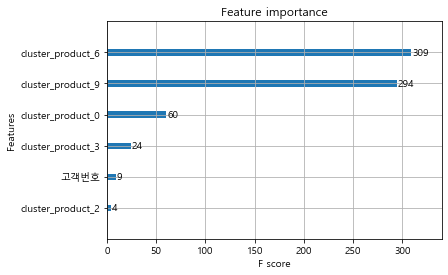

- 새로 생성한 가변수들이 분류에 중요 변수로 작용한 것을 확인할 수 있다.


 

 

# 6. Conclusion

### 결과 및 개선사항

- DecisiontTree 정확도는 83% 결과로 VIP를 예측하였다.
- RandomForest 정확도는 66% 결과로 VIP를 예측하였다. -> 데이터 샘플 수의 부족
- XGBoost 정확도는 86% 결과로 VIP를 예측하였다. -> boosting 기법으로 더욱 향상된 정확도를 도출하였다.
- 정확도의 개선으로 clustering의 조정이 필요하다.
- clustering : 계층적 군집분석, DBSCAN 이용

### 후기

- 단순 고객정보 데이터로 고객 행동이나 형태를 예측하기는 어렵다.
- 고객들의 구매 내역과 같은 데이터가 제공되어야 향후 행태를 예측해볼 수 있다.
- 추천시스템 구성을 위해 적정 기간의 고객의 구매성향을 알 수 있어야 한다.
- 추천시스템은 신규고객을 대상으로 적용시키기 어렵기 때문에 사전정보를 얻기 위해 가입시 설문조사가 필요하다.

### 향후 진행방향
- 분석한 데이터를 기반으로 clustring 진행
- 고객 군집을 대상으로 하는 추천시스템 개발
- 고객 개인을 대상으로 하는 추천시스템 개발
